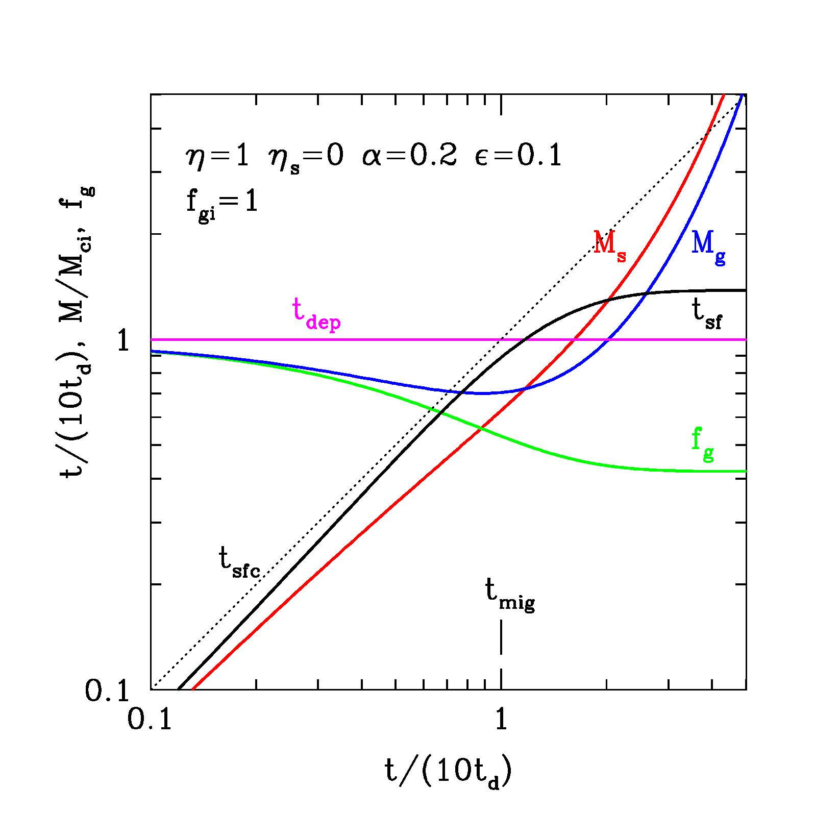
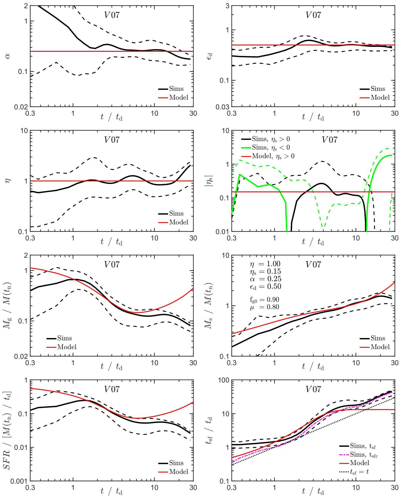
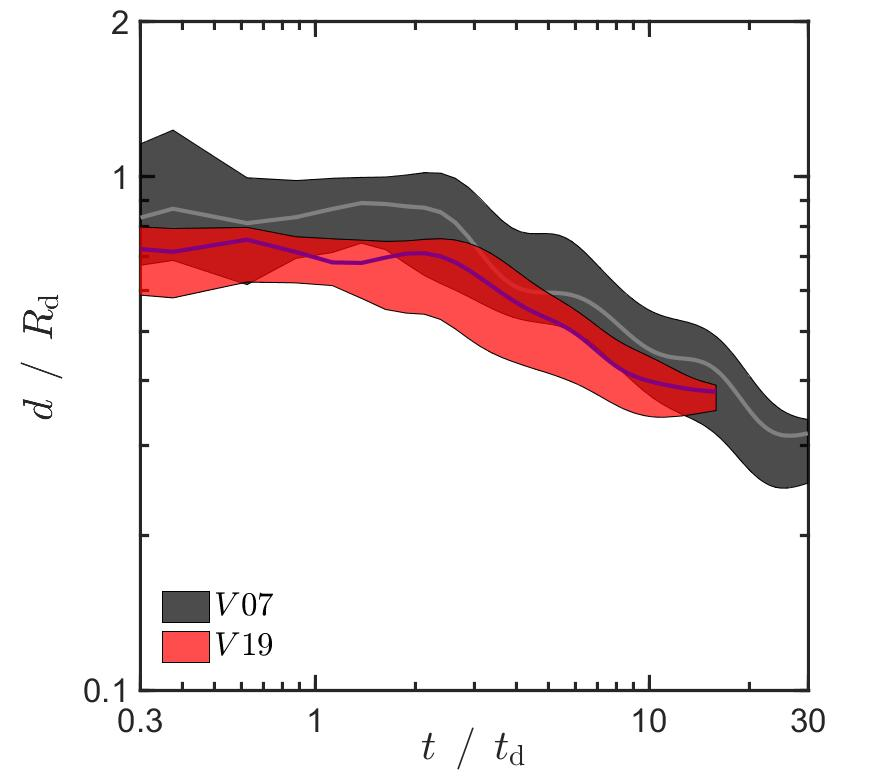
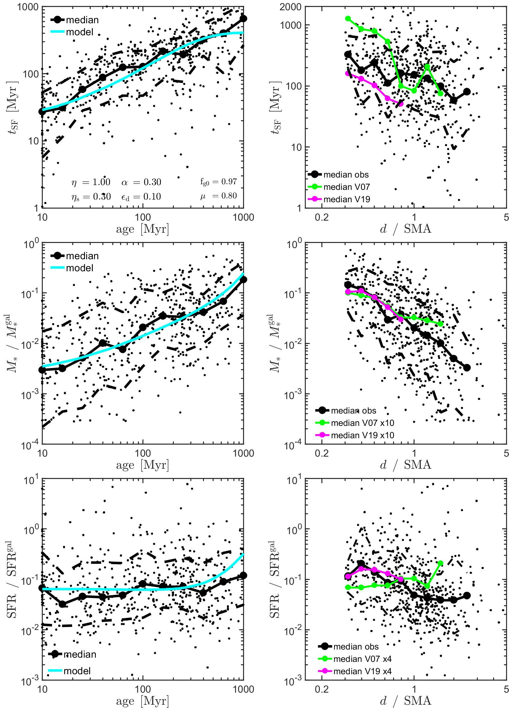

# Clump Evolution: An Analytic "Bathtub" Model vs. High-Cadence Tracking

**An 8-line differential-equation model of how giant clumps live and die,
validated against hundreds of tracked clump histories from simulations, both 
cosmological and idealized, and against Hubble Space Telescope observations.**

This project is the modeling layer built on top of the
[clump finder & tracker](../Galaxy_Catalogues_and_Clump_Finder/): having
detected and tracked thousands of clumps, the question became whether their
life cycle could be captured by a simple, predictive analytic model. The
result is published in
[Dekel, Mandelker, Bournaud et al. 2022, MNRAS 511, 316](https://arxiv.org/abs/2107.13561).

## The problem

Whether giant clumps survive long enough to migrate to their galaxy's center, 
or are destroyed within a few tens of millions of years by energetic feedback 
from their own star-formation, was a decade-long debate with different simulation 
codes giving different answers depending on their feedback physics. What was 
missing was a *transparent* model: one where each physical process is a term 
you can tune up or down, so you can see exactly what drives survival or disruption, 
rather than another expensive and 'black-box' simulation.

## The model

A clump is treated as a "bathtub" with mass flowing in and out
(`analysis/clump_evolution_exact.m`). The complete model is three coupled
ordinary differential equations, eight lines of code:

- **In:** gas accreted from the surrounding disc (rate parameter α)
- **Out:** gas turned into stars (efficiency ε per free-fall time and 
  retention rate μ), gas expelled by stellar-feedback outflows (mass-loading 
  factor η), and stars stripped by tidal forces (effective mass-loading 
  factor η_s).
- **Meanwhile:** the clump migrates inward via dynamical friction and torques
  (migration timescale t_mig)

`fig_clump_bathtub.m` integrates the system to produce the model-solution
curves (the figure below). Also included is `clump_evolution_exact2.m`, an
exploration that did not go into the paper as-is: it maps the final clump
properties interpolated to the moment the clump reaches the disc center,
across the feedback-strength parameter space.


*Model solution for one parameter choice: clump gas mass, stellar mass, gas
fraction, and radius as functions of time since clump formation. Each curve
responds transparently to the accretion, star-formation, outflow, and
migration parameters. From Dekel, Mandelker et al. 2022, Fig. 1.*

## The test against simulations

The model's inputs and predictions were confronted with high time-resolution 
(the "thin-timesteps") clump tracking produced by the
[pipeline in this repository](../Galaxy_Catalogues_and_Clump_Finder/src/thin_timesteps/). 
This was applied to two cosmological simulations (VELA 07 and 19, aka V07 and V19) 
and, with a lightly adapted input stage, to isolated-galaxy RAMSES simulations run 
with and without radiation-pressure feedback (by F. Bournaud's group).

The heavy lifting is in `prop_vs_t_over_tdyn_rectangle.m` (~1,400 lines —
an amusing contrast with the 8-line model it tests, and called by the
`launch_prop_vs_t_over_tdyn.m` driver): it applies sample cuts to the
tracked clump histories, aligns them by time since clump formation, stacks
them (mean or median, with scatter) into average evolution tracks, smooths 
over noisy data, and finally integrates the analytic model inside the plotting 
routine to overlay the model curves on the stacked simulation tracks. This 
produced the paper's simulation-vs-model figure panels. The other `launch_*` 
drivers and their analysis functions (`prop_vs_time.m`, `specific_rates.m`,
`clump_property_histograms.m`) produced the supporting property and rate
comparisons. Crucially, the specific rates the model treats as free parameters 
(gas accretion, star formation, gas outflow, stellar stripping) were also 
*measured directly* from the simulations, and the model was plotted with those 
measured values. So, up to the unavoidable measurement choices (interpolation, 
smoothing, error estimation), the comparison has no hand-tuned knobs.


*The central comparison, for the cosmological galaxy V07 (37 tracked
clumps). Top four panels: the model's rate parameters — accretion α,
star-formation efficiency ε_d, and the gas and stellar outflow
mass-loadings η, η_s — measured directly from the stacked simulation
histories (black, with scatter); the red lines are the constant values
adopted by the model. Bottom four panels: the resulting evolution of gas
mass, stellar mass, SFR, and star-formation time, simulation stacks in
black, the analytic model in red. From Dekel, Mandelker et al. 2022,
Fig. 6.*


*Tracked clumps migrate inward: median galactocentric distance vs. time
since formation for the clumps in the two cosmological simulations, in units
of the disc radius and disc dynamical time. From Dekel, Mandelker et al.
2022, Fig. 9.*

## The test against observations

`read_Guo2.m` ingests the observed clump catalog of Guo et al. (HST/CANDELS
galaxies), applies selection cuts consistent with the simulation analysis,
and compares the observed trends of clump properties with stellar age and
galactocentric distance against the model predictions. The model matches
the observed gradients of star-forming clumps.


*The observational test: each dot is an observed clump from the HST/CANDELS
catalog of Guo et al. Left column: star-formation time, clump stellar mass,
and SFR against clump stellar age, with the analytic model in cyan (its
parameters listed in the top panel). Right column: the same properties
against galactocentric distance, with the median trends of the simulated
clumps (V07, V19) overlaid on the observed medians. From Dekel, Mandelker
et al. 2022, Fig. 10.*

## Results, briefly

Massive clumps (above ~10⁸ solar masses) are wounded but not killed by
feedback: they can either lose gas continuously yet survive or they can 
net grow in mass by accretion from the background disc. Either way, they 
migrate to the galaxy center within a few disc dynamical times. Low-mass 
clumps, on the other hand, disrupt due to catastrophic mass loss on a 
dynamical time. The same dichotomy was found statistically in Mandelker 
et al. 2017 (long-lived and migrating vs. short-lived and disrupted), 
but now sharpened from a classification into a quantitative evolution 
model where the dependence on feedback strength is clear and transparent.

## Contents

```
├── README.md            ← this file
├── analysis/            ← MATLAB: the analytic model (clump_evolution_exact*.m),
│                           simulation stacking (clump_evolution.m, launch_* +
│                           their analysis functions), catalog loading
│                           (load_data.m, load_gen3.m, add_properties.m), and
│                           the observational comparison (read_Guo2.m)
└── figures/             ← publication figures (from my own papers, cited)
```

The Fortran tracking code this project consumes is published in the
[clump finder project](../Galaxy_Catalogues_and_Clump_Finder/); the RAMSES
input variant differed only in its reader. Catalog data files are not
included (see the clump finder's `sample_output/` for the format).
