# Cold Stream Stability: One Physical Ingredient at a Time

**Analytic instability theory + numerical experiments I designed and ran
myself — an eleven-work research program (and counting) built by adding 
one piece of physics at a time, with a governing dimensionless number 
identified at every step.**

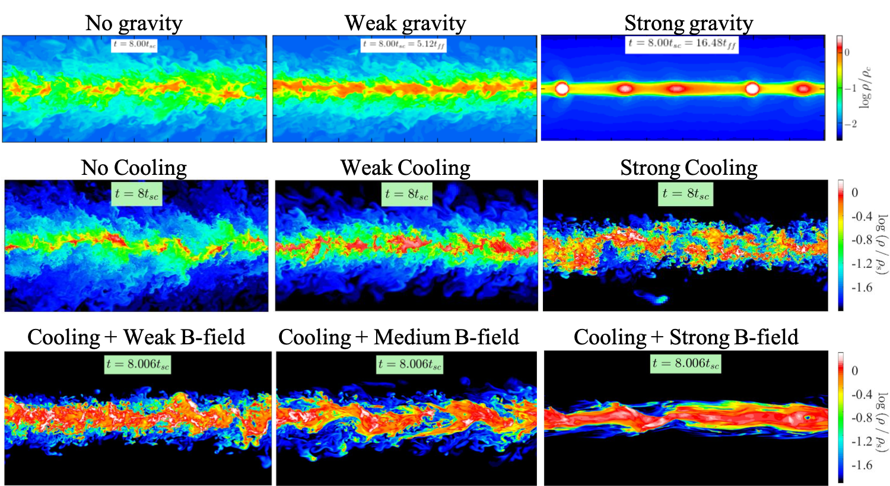
*The method in one frame: gas density at late times in idealized cold-stream simulations
as each new physical ingredient is added and dialed up. **Top:** self-gravity
(none → weak → strong) — strong gravity fragments the stream into clumps.
**Middle:** radiative cooling (none → weak → strong) — cooling reshapes the
turbulent mixing layer and the density distribution. **Bottom:** magnetic fields 
at fixed cooling (weak → medium → strong) — fields smooth the interface and help 
the stream survive. Each row is governed by its own dimensionless number (Sections 
below). The magnetic-field row is from work not yet published.*

Unlike the giant-clumps projects in this repository, where I built the
measurement instruments for simulations run by others, here I posed the
questions, derived the theory, designed and ran the simulations (with the
public AMR code [RAMSES](https://arxiv.org/abs/astro-ph/0111367), extended
through custom patches), and built the analysis. Several stages were led by
students and postdocs I supervised (D. Padnos, H. Aung, Z. Yao), and the program's
predictions have been applied by independent observational teams, including
in a *Science* paper (https://arxiv.org/abs/2303.17484), where I served as 
lead theorist interpreting observations of cold-streams.

## The problem

The most massive galaxies in the young Universe grew by feeding on narrow
streams of cold gas that flowed in along filaments of the cosmic web,
penetrating halos of hot gas that surround the galaxies. Whether a stream 
survives the journey or is shredded by the Kelvin–Helmholtz instability 
(KHI) at the interface between the rapidly inflowing cold stream and its hot 
surroundings, determines how these galaxies were fed. The stream–halo system 
is far outside the regime where classical stability theory applies: the streams 
are supersonic, the density contrast is huge, gravity, radiative cooling, and 
magnetic fields all act at once, and the nonlinear outcome (disruption vs. 
survival) cannot be read off from linear theory.

## The method

Rather than simulating the fully coupled system at once, the program builds
from the bottom up: start from pure hydrodynamics, then admit one new physical
ingredient at a time. Each *new piece of physics* is characterized by a *dimensionless
number* that determines whether it changes the leading-order answer. This is the
organizing principle of the whole program. 

| Physical ingredient | Governing dimensionless number | Works |
|---|---|---|
| Hydrodynamics | Mach number M_b, density contrast δ | [Mandelker et al. 2016](https://arxiv.org/abs/1606.06289) (linear); [Padnos, Mandelker et al. 2018](https://arxiv.org/abs/1803.09105) (2D nonlinear); [Mandelker et al. 2019](https://arxiv.org/abs/1806.05677) (3D nonlinear) |
| Cosmological setting | stream radius / halo virial radius (set by halo mass & redshift) | [Mandelker et al. 2018](https://arxiv.org/abs/1711.09108); [Mandelker et al. 2020b](https://arxiv.org/abs/2003.01724); [Aung, Mandelker et al. 2024](https://arxiv.org/abs/2403.00912) |
| Self-gravity | KHI disruption time / free-fall time | [Aung, Mandelker et al. 2019](https://arxiv.org/abs/1903.09666); [Mandelker et al. 2018](https://arxiv.org/abs/1711.09108) |
| Radiative cooling | KHI disruption time / mixing-layer cooling time | [Mandelker et al. 2020a](https://arxiv.org/abs/1910.05344); [Mandelker et al. 2020b](https://arxiv.org/abs/2003.01724); [Aung, Mandelker et al. 2024](https://arxiv.org/abs/2403.00912) |
| Thermal shattering & stream–halo pressure contrast | cooling time / sound-crossing time | [Yao, Mandelker et al. 2025](https://arxiv.org/abs/2410.12914); [Yao, Mandelker & Oh 2026](https://arxiv.org/abs/2607.14090) |
| Magnetic fields | plasma β | as yet unpublished (complete; presented at conferences) |

Two pieces of the program are shown here in full, chosen because their code is
the most *distinct*: the **linear theory with its simulation verification**, and 
the **radiative-cooling pipeline** end to end. The self-gravity and magnetic-field ingredients 
are shown through their key results rather than their code, which is qualitatively similar to 
the code presented, and shares much of the same machinery.

---

## Hydrodynamics: linear theory, and making the simulations prove it

`linear_theory/` contains the analytic engine of Mandelker et al. 2016
(MNRAS 463, 3921): a Mathematica notebook (`nir_test_adiabatic.nb`) that
numerically solves the linear dispersion relations for KHI in planar-slab 
geometry, and the MATLAB layer that turns those solutions (along with solutions 
in cylindrical geometries obtained in other notebooks) into growth-rate maps, 
phase diagrams, mode structures, and stability boundaries.


*The parameter space in one figure: KHI growth rate for a single interface
(sheet) as a function of the two governing dimensionless numbers: Mach
number of the stream velocity with respect to the background sound speed, M_b, 
and the density ratio (contrast) between the stream and the background δ. Such modes 
are called **surface modes** as they live at the interface between the two fluids. 
The white line is an analytical solution to the curve above which surface modes stabilize. 
From Mandelker et al. 2016, Fig. 1.*

The paper's central result is that in the supersonic regime, where
classical surface modes are stable and one might conclude streams survive,
a family of slower-growing **body modes** (waves reverberating inside the
stream itself) takes over the instability:


*Numerical solution of the slab dispersion relation at M_b = 1.5, δ = 100, with the analytical 
approximation overlaid (thick dot-dashed line). In this regime, the single interface is stable 
yet the slab is unstable through body modes. Growth rates (left) and phase velocities (right) 
for the mode families. The solution grids behind this figure were produced by the notebook in 
`linear_theory/`. From Mandelker et al. 2016, Fig. 4.*


*What a "body mode" actually is: pressure-perturbation structure of the
first six unstable modes of the slab. While surface modes cling to the
interfaces, body modes fill the interior with standing-wave patterns. From
Mandelker et al. 2016, Fig. 5.*

### Verification: seeding simulations with the theory's eigenmodes

The theory was then tested in RAMSES simulations through a patch 
(`linear_theory/verification/`) whose initial conditions can perturb 
a single fluid variable *or inject the full analytic eigenmode*. The 
namelist literally takes the complex eigenfrequency computed by the 
Mathematica notebook as an input parameter 
(`pert_omega(1)=(487.286, 318.530)` in `kh_eigenmode.nml`). Two namelists 
are included: one initializing a full eigenmode perturbation and 
one initializing a simple sinusoidal perturbation in the pressure alone.


*The verification: amplitude growth of eigenmode-seeded perturbations in
five simulations spanning the (M_b, δ) parameter space, against the
predicted exponential growth (dashed). From Mandelker et al. 2016, Fig. 8.*


*The stronger test: a simulation seeded with a generic (non-eigenmode)
perturbation spontaneously develops the structure of the predicted
fastest-growing eigenmode (left and centre panels vs. the analytic
prediction on the right). In other words, the simulation "discovers" 
the theory's answer. The measured growth rates likewise converge to 
the fastest-growing mode's prediction (M16, Fig. 9). From Mandelker 
et al. 2016, Fig. 10.*

### First application to real streams


*The astrophysical payoff, first version: number of instability e-foldings
a cold stream experiences while crossing its host halo, over the
(M_b, δ) parameter space, for three ratios of the stream radius to the halo 
virial radius and the perturbation wavelength to the stream radius (two additional 
dimensionless numbers). This "can the stream survive?" figure recurs throughout 
the paper series, updated as each new physical ingredient is added. From Mandelker 
et al. 2016, Fig. 11.*

---

## Radiative cooling: the full simulation-to-analysis pipeline

The pivotal stage of the program, and the one shown here end to end. Adding
radiative cooling changes the answer qualitatively: instead of being eroded
by the instability, a cold stream can *grow* by entraining initially hot gas 
that mixes, cools, and condenses in a turbulent radiative mixing layer (TRML) 
that forms at the stream-halo interface. This is published in 
[Mandelker et al. 2020a](https://arxiv.org/abs/1910.05344) (MNRAS 494, 2641).

The governing dimensionless number for this stage is the ratio of the
**cooling time in the turbulent mixing layer to the shear (disruption) time**,
`t_cool,mix / t_shear`. When mixed gas cools faster than the instability can
disrupt the stream, hot material condenses onto the stream rather than
tearing it apart.

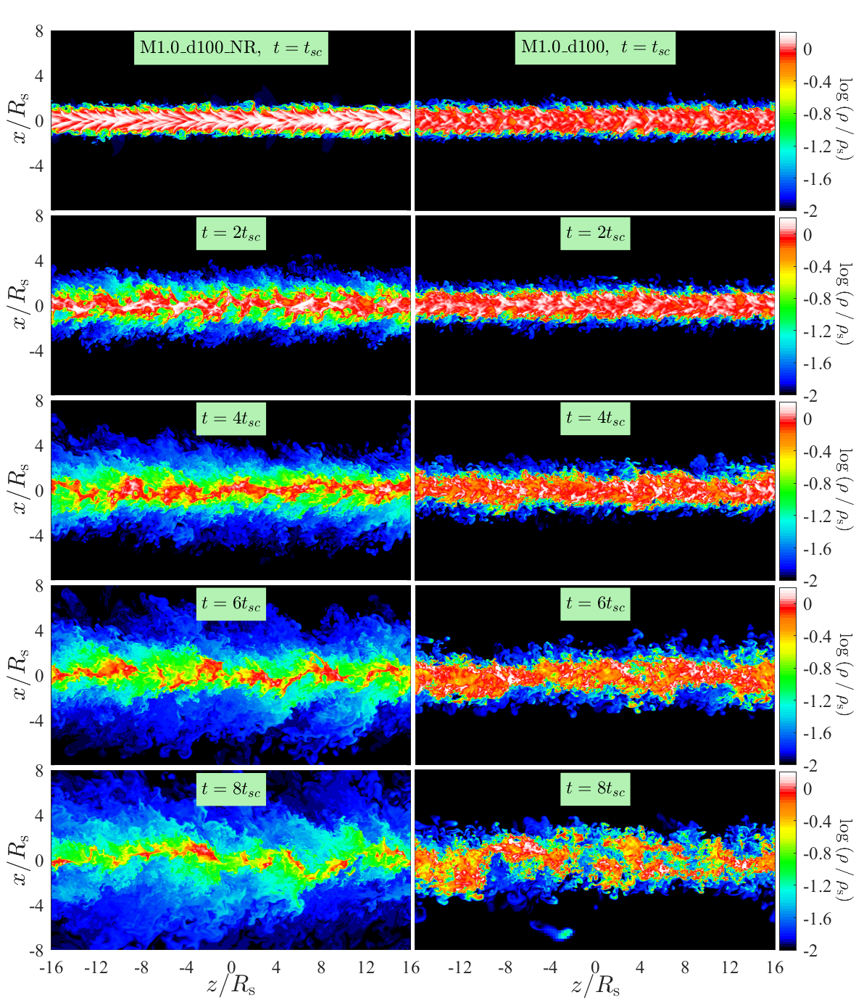
*The result, visually: gas density in an idealized stream simulation over
eight sound-crossing times, without radiative cooling (left) and with fast 
cooling, `t_cool,mix / t_shear < 1` (right). Without cooling the stream diffuses 
into a broad, low-density wake; with fast cooling it stays dense and coherent, 
actually gaining cold mass. From Mandelker et al. 2020a, Fig. 2.* 

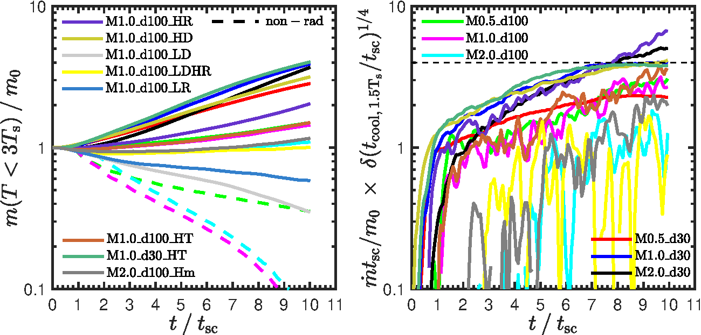
*The quantitative headline: cold-gas mass versus time. Without cooling
(dashed) the cold stream mass declines; with cooling (solid) it *grows* 
if `t_cool,mix / t_shear < 1`, as hot gas is entrained and cooled through 
the TRML, and declines when `t_cool,mix / t_shear > 1`, similar to case 
without any cooling. From Mandelker et al. 2020a, Fig. 5.*

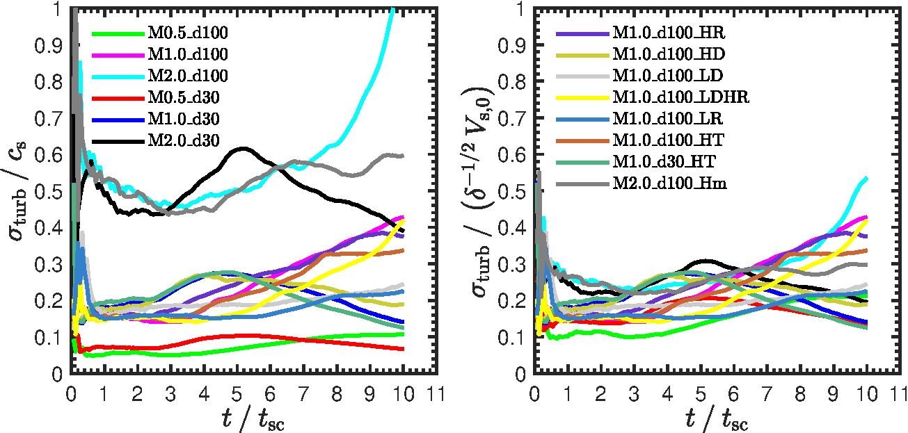
*The mixing-layer turbulence that drives entrainment, measured from the
simulations. This is one of the many diagnostics computed by the analysis 
pipeline in `cooling_simulations/analysis/`. From Mandelker et al. 2020a, 
Fig. 8.*

**The vertical slice.** `cooling_simulations/` contains the pipeline behind
these results: the RAMSES patch that sets up and runs the simulations, the
Fortran tools that convert raw outputs to a compact analysis format, and the
Fortran analysis codes that measure stream properties (and forward-model
synthetic observations). See its [README](cooling_simulations/) for the
walkthrough.

The linear theory of KHI *with* cooling (a much larger parameter space —
cooling-curve slopes and densities in each medium) was also worked out in
Mathematica but did not make the paper; it is not included here.

## The other ingredients, in brief

The self-gravity and magnetic-field ingredients are shown here through their
key results rather than through code (the two corresponding rows in the panel at
the top of this page is the qualitative summary).

### Self-gravity

When the stream's self-gravity is strong enough, namely when the free-fall time 
is shorter than the KHI disruption time, the stream can fragment under its own 
weight before the instability destroys it. Applied to a real cosmological simulation,
this predicts star formation *inside the streams*, out in the halo, far from
the galaxy: a candidate formation channel for metal-poor globular clusters
([Mandelker et al. 2018](https://arxiv.org/abs/1711.09108)).

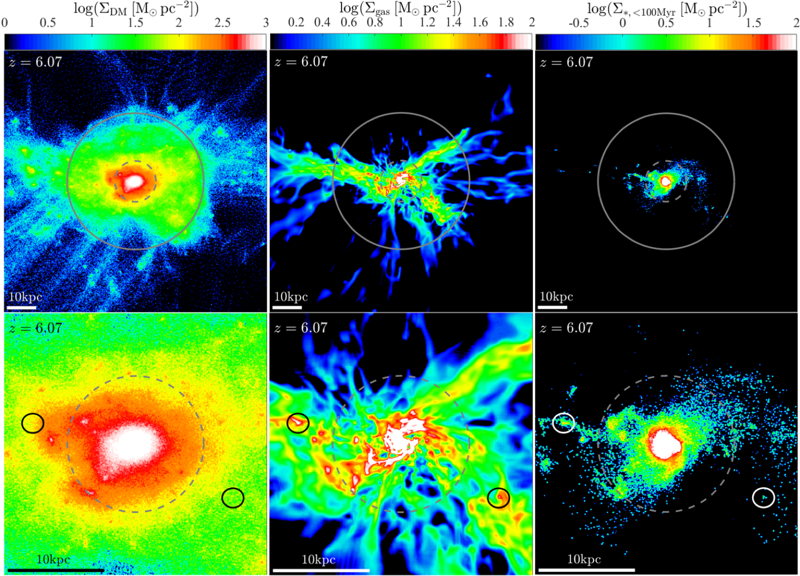
*Simulated galaxy VELA19 at redshift z = 6.07, ~13 billion years ago. Columns:
surface density maps of dark-matter, gas, and young-stars (< 100 Myr); top row 
a wide view (solid circle = halo virial radius), bottom row a zoom (dashed circle 
= 0.3 times the halo virial radius). Cold streams feed the halo along the cosmic 
web; the small circles mark dense, star-forming clumps that have formed within the 
streams themselves, outside the central galaxy, with no dark-matter overdensities. 
These are the predicted globular-cluster birthplaces. From Mandelker et al. 2018.*

### Magnetic fields

Adding magnetic fields introduces the plasma β (thermal / magnetic pressure).
Two results stand out (as-yet-unpublished, conference-presented):

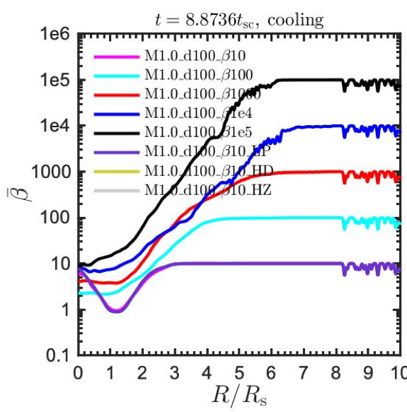
*Field amplification with cooling: radial profiles of the mean plasma β at
late times, for a range of initial field strengths. Even a stream that starts
essentially unmagnetized (β ≈ 10⁵, black) has its field amplified toward
equipartition (β ≈ 1–10) in the cooling-driven turbulent mixing layer near the
stream core.*

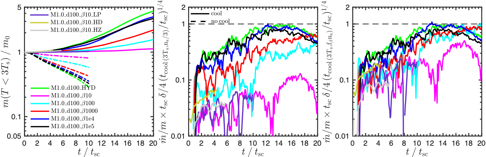
*The method surviving a new ingredient. Left: cold-mass growth for a range of
β. The apparent β-dependence of the entrainment rate (centre) collapses onto
the single predicted value (right, dashed line at unity) once the mixing-layer
cooling time is evaluated with the gas density set by **total** (thermal +
magnetic) pressure balance rather than thermal-pressure balance alone. With
that one physically-motivated change of variable, the same turbulent-radiative-
mixing-layer theory derived for the pure-cooling case describes every run with
β ≳ 10.*

## From model to telescope: predicting what's observable

This is the payoff of the whole program, and the piece that translates most
directly to outside astrophysics: a **physics-based forward model that turns the
idealized-simulation results into a prediction of a real, observable signal**,
which independent teams then tested against telescope data.

The cosmological setting fixes the two base numbers (M_b, δ) from first
principles, as a function of halo mass and redshift, by assuming that the 
stream is inflowing at the halo virial velocity and is in pressure equilibrium 
with the hot halo at the virial temperature. Folding in the impact of the halo 
potential on the equilibrium configuration, and the cooling-driven dissipation 
from the stages above, the model ([Mandelker et al. 2020b](https://arxiv.org/abs/2003.01724)) 
predicts how much energy each stream radiates, and at what wavelength, as it 
falls in. The code is in `cosmological_model/`.

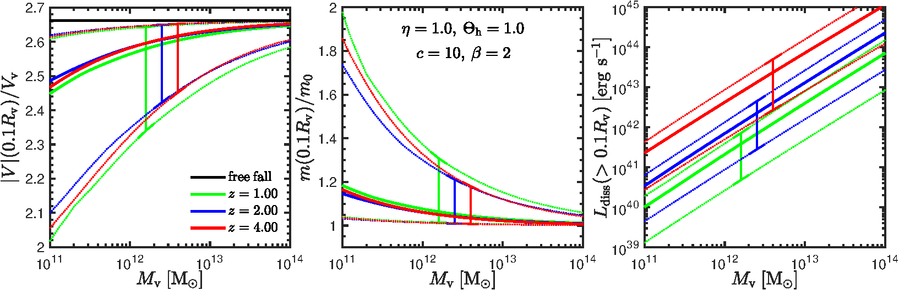
*The forward model's output, as a function of halo mass and for different redshifts (colours):
stream infall velocity (left), cold-mass growth by entrainment (centre), and
the dissipation luminosity radiated mostly as Lyman-α (right). For massive
halos (10¹²–10¹³ M☉) the model predicts Lyman-α luminosities of
~10⁴²–10⁴³ erg/s — squarely in the range of observed "Lyman-α blobs." From
Mandelker et al. 2020b.*

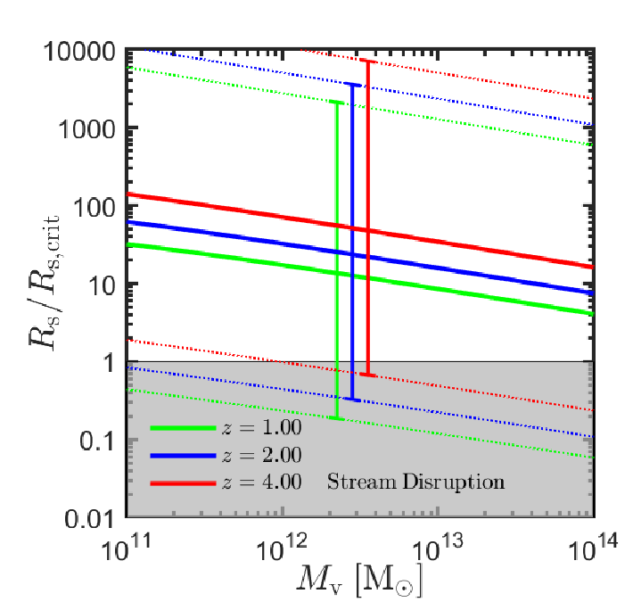
*The survival map: the ratio of stream radius to the critical radius for
cooling to beat disruption, versus halo mass, at three redshifts. Essentially
all cosmologically realistic streams (solid lines) sit well above the
disruption threshold (grey). The conclusion is that most cold streams 
survive their journey to the galaxy. From Mandelker et al. 2020b.* 

**Validated against real data.** The model was carried through to direct
comparison with observations in
[Aung, Mandelker et al. 2024](https://arxiv.org/abs/2403.00912): the
stream-entrainment physics is added onto the analytic gas-regulator ("bathtub")
model of [Dekel & Mandelker 2014](https://academic.oup.com/mnras/article/444/3/2071/1049825)
(MNRAS 444, 2071) — a framework I co-developed — which predicts how fast
galaxies form stars over cosmic time. This is the same class of analytic 
gas-regulator model applied to giant clumps in the 
[clump-evolution project](../Clump_Evolution_Model/) elsewhere
in this repository — one framework, two very different problems, each 
tested against data.

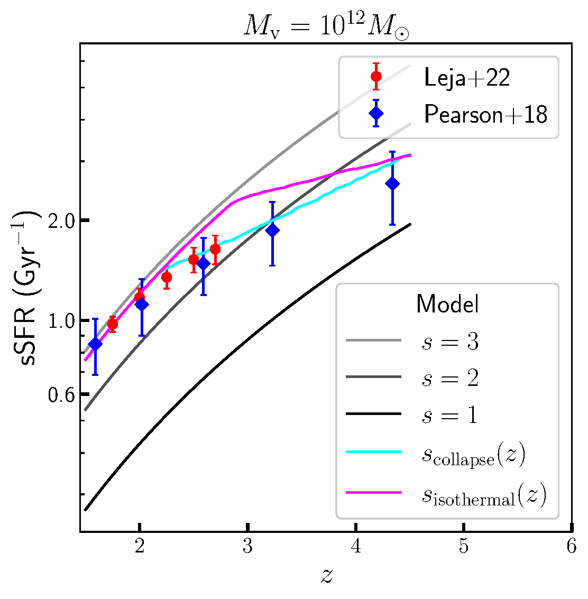
*The model against measurements: specific star-formation rate versus redshift
for galaxies in 10¹² M☉ halos. Coloured lines are the model (for different
assumptions about the stream); the points are observational determinations
(red: Leja et al. 2022; blue: Pearson et al. 2018). The physics-based model,
built up from idealized stream simulations, reproduces the observed
star-formation history with no fitting to these data. From Aung, Mandelker
et al. 2024.*

The Lyman-α side of the forward model was likewise used to interpret actual
detections. Independent teams applied it to real data with no involvement from 
me: Daddi et al. 2021/2022b (cold streams and galactic specific-SFR trends 
across redshift); Wang et al. 2021, Arrigoni Battaia et al. 2022, and 
Johnson et al. 2022 (MUSE observations of cold streams and circumgalactic gas). 
It was also used to interpret direct ALMA observations of a cold stream in 
Emonts et al. 2024, a *Science* paper on which I am a co-author. In industry 
terms this is the full loop: a 
physics-based model of a hidden state, forward-modeled into a predicted observable, 
then confronted with measurements. This is the same operation as sensor forward-modeling 
or state estimation, in a different domain. 

A second observable comes with code, and out of a later collaboration. After
this project was published, I contributed to a multi-group code-comparison
study (Hafen et al. 2024, MNRAS 528, 39), prompted by observers wanting to
know how far their standard methods for interpreting absorption-line measurements 
can be trusted for systems like these. I extended my existing analysis codebase 
to forward-model the simulations into **synthetic quasar absorption sightlines**, 
ray-tracing through the simulated stream and hot halo to predict the ion column 
densities an instrument would record. The goal was not to reproduce any specific 
real system, but to use the simulation as a *known ground truth* and measure how 
much the commonly-used observational methods bias the quantities they recover. That 
code is [`cooling_simulations/analysis/Sightlines.f90`](cooling_simulations/analysis/Sightlines.f90),
and it demonstrates two transferable things at once: generating synthetic
observations from a physical model to characterize a measurement method's
systematic biases against known truth (synthetic-data / measurement-validation
work), and extending a mature codebase to meet a downstream collaboration's
concrete, scoped ask.

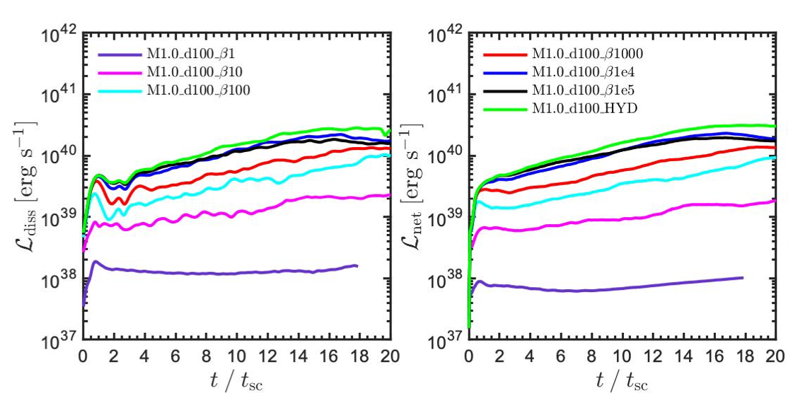
*Robustness of the prediction to added physics: the dissipation luminosity
over time for a range of plasma β. For realistically weak fields (β ≳ 1000)
the luminosity tracks the pure-hydrodynamic case (green/black), so the
observable prediction is largely unchanged by magnetic fields, and only very
strong fields would suppress it. From the unpublished magnetic-fields study.*

## Contents

```
├── README.md
├── linear_theory/                   ← Hydrodynamics (M16): dispersion relations
│   ├── nir_test_adiabatic.nb        ← Mathematica slab solver
│   ├── *.m                          ← MATLAB analysis of the solutions
│   ├── sample_output_ImP_00.csv     ← example solver output
│   └── verification/                ← RAMSES patch + growth-measurement script
├── cooling_simulations/             ← Radiative cooling (M20a): the full vertical slice
│   ├── ramses_patch/                ← RAMSES patch with modified cooling + namelist
│   ├── conversion/                  ← raw RAMSES → compact AMR-leaf format
│   └── analysis/                    ← Fortran stream-property measurement + Sightlines forward model
├── cosmological_model/              ← Forward model (M20b): stream properties &
│                                      Lyman-α emission vs halo mass and redshift
└── figures/                         ← publication figures (my papers, cited)
```

Additional material (the nonlinear-hydrodynamics simulations, the Lyman-α
forward model, and further conference figures from the unpublished
magnetic-fields study) may be added incrementally.
