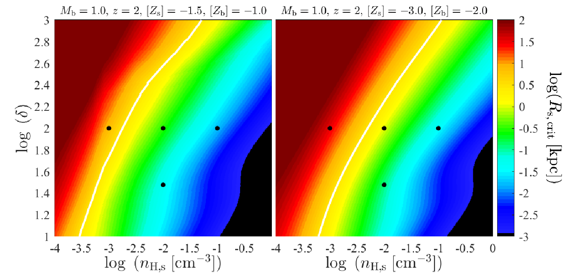

# Cold Stream Stability: One Physical Ingredient at a Time

**Analytic instability theory + numerical experiments I designed and ran
myself — an eleven-work research program (and counting) built by adding 
one piece of physics at a time, with a governing dimensionless number 
identified at every step.**


*The method in one frame: gas density in idealized cold-stream simulations
as each new physical ingredient is added and dialed up. **Top:** self-gravity
(none → weak → strong) — strong gravity fragments the stream into clumps.
**Middle:** radiative cooling (none → weak → strong) — cooling reshapes the
turbulent mixing layer. **Bottom:** magnetic fields at fixed cooling (weak →
medium → strong) — fields smooth the interface and help the stream survive.
Each row is governed by its own dimensionless number (Sections below). The
magnetic-field row is from work not yet published.*

Unlike the giant-clumps projects in this repository, where I built the
measurement instruments for simulations run by others, here I posed the
questions, derived the theory, designed and ran the simulations (with the
public AMR code [RAMSES](https://arxiv.org/abs/astro-ph/0111367), extended
through custom patches), and built the analysis. Several stages were led by
students and postdocs I supervised (D. Padnos, H. Aung, Z. Yao), and the program's
predictions have been applied by independent observational teams, including
in a *Science* paper (https://arxiv.org/abs/2303.17484), where I served as 
lead theorist interpreting observations of cold-streams.

## The problem

The most massive galaxies in the young Universe grew by feeding on narrow
streams of cold gas that flowed in along the filaments of the cosmic web,
through halos of hot gas. Whether a stream survives the journey or is
shredded by the Kelvin–Helmholtz instability (KHI) at the interface 
between the fast, cold, dense stream and the hot surroundings, determines
how these galaxies were fed. The stream–halo system is far outside the
regime where classical stability theory applies: the streams are supersonic,
the density contrast is huge, gravity, radiative cooling, and magnetic
fields all act at once, and the nonlinear outcome (disruption vs. survival)
cannot be read off from linear theory.

## The method

Rather than simulating the fully coupled system at once, the program builds
from the bottom up: start from pure hydrodynamics, then admit one new physical
ingredient at a time. Each *ingredient* is characterized by the *dimensionless
number* that determines whether it changes the leading-order answer — the
organizing principle of the whole program. (The distinction matters: a
dimensionless number classifies new physics, not a new evolutionary stage. The
nonlinear evolution of the hydrodynamic case, for instance, introduces no new
number; its outcome is diagnosed by the ratio of the stream's disruption time
to its virial-crossing time.)

| Physical ingredient | Governing dimensionless number | Works |
|---|---|---|
| Hydrodynamics | Mach number M_b, density contrast δ | [Mandelker et al. 2016](https://arxiv.org/abs/1606.06289) (linear); [Padnos, Mandelker et al. 2018](https://arxiv.org/abs/1803.09105) (2D nonlinear); [Mandelker et al. 2019](https://arxiv.org/abs/1806.05677) (3D nonlinear) |
| Cosmological setting | stream radius / halo virial radius (set by halo mass & redshift) | [Mandelker et al. 2018](https://arxiv.org/abs/1711.09108); [Mandelker et al. 2020b](https://arxiv.org/abs/2003.01724); [Aung, Mandelker et al. 2024](https://arxiv.org/abs/2403.00912) |
| Self-gravity | disruption time / free-fall time | [Aung, Mandelker et al. 2019](https://arxiv.org/abs/1903.09666); [Mandelker et al. 2018](https://arxiv.org/abs/1711.09108) |
| Radiative cooling | disruption time / mixing-layer cooling time | [Mandelker et al. 2020a](https://arxiv.org/abs/1910.05344); [Mandelker et al. 2020b](https://arxiv.org/abs/2003.01724); [Aung, Mandelker et al. 2024](https://arxiv.org/abs/2403.00912) |
| Thermal shattering & stream–halo pressure contrast | cooling time / sound-crossing time | [Yao, Mandelker et al. 2025](https://arxiv.org/abs/2410.12914); [Yao, Mandelker & Oh 2026](https://arxiv.org/abs/2607.14090) |
| Magnetic fields | plasma β | as yet unpublished (complete; presented at conferences) |

Two pieces of the program are shown here in full, chosen because their code is
the most *distinct* (the hydrodynamic and cooling stages share the same
analysis machinery across most of the intermediate papers): the **linear
theory with its simulation verification**, and the **radiative-cooling
pipeline** end to end. The self-gravity and magnetic-field ingredients are
shown through their key results rather than their code.

---

## Hydrodynamics: linear theory, and making the simulations prove it

`linear_theory/` contains the analytic engine of Mandelker et al. 2016
(MNRAS 463, 3921): a Mathematica notebook (`nir_test_adiabatic.nb`) that
numerically solves the linear dispersion relations for KHI in planar-slab 
geometry, and the MATLAB layer that turns those solutions (along with solutions 
in cylindrical geometries obtained in other notebooks) into growth-rate maps, 
phase diagrams, mode structures, and stability boundaries.


*The parameter space in one figure: KHI growth rate for a single interface
(sheet) as a function of the two governing dimensionless numbers: Mach
number of the stream velocity with respect to the background sound speed, M_b, 
and the density ratio (contrast) between the stream and the background δ. 
From Mandelker et al. 2016, Fig. 1.*

The paper's central result is that in the supersonic regime, where
classical surface modes are stable and one might conclude streams survive,
a family of slower-growing **body modes** (waves reverberating inside the
stream itself) takes over the instability:


*Numerical solution of the slab dispersion relation at M_b = 1.5, δ = 100. In this 
regime, the single interface is stable yet the slab is unstable through body modes. 
Growth rates (left) and phase velocities (right) for the mode families. The solution 
grids behind this figure were produced by the notebook in `linear_theory/`. From 
Mandelker et al. 2016, Fig. 4.*


*What a "body mode" actually is: pressure-perturbation structure of the
first six unstable modes of the slab. While surface modes cling to the
interfaces, body modes fill the interior with standing-wave patterns. From
Mandelker et al. 2016, Fig. 5.*

### Verification: seeding simulations with the theory's eigenmodes

The theory was then tested in RAMSES simulations through a patch 
(`linear_theory/ramses_verification/`) whose initial conditions can perturb 
a single fluid variable *or inject the full analytic eigenmode*. The 
namelist literally takes the complex eigenfrequency computed by the 
Mathematica notebook as an input parameter 
(`pert_omega(1)=(487.286, 318.530)` in `kh_eigenmode.nml`). Two namelists 
are included: one initializing a full eigenmode perturbation and 
one initializing a simple sinusoidal perturbation in the pressure alone.


*The verification: amplitude growth of eigenmode-seeded perturbations in
five simulations spanning the (M_b, δ) parameter space, against the
predicted exponential growth (dashed). From Mandelker et al. 2016, Fig. 8.*


*The stronger test: a simulation seeded with a generic (non-eigenmode)
perturbation spontaneously develops the structure of the predicted
fastest-growing eigenmode (left and centre panels vs. the analytic
prediction on the right) — the simulation "discovers" the theory's answer.
The measured growth rates likewise converge to the fastest-growing mode's
prediction (M16, Fig. 9). From Mandelker et al. 2016, Fig. 10.*

### First application to real streams


*The astrophysical payoff, first version: number of instability e-foldings
a cold stream experiences while crossing its host halo, over the
(M_b, δ) parameter space, for three ratios of the stream radius to the halo 
virial radius and the perturbation wavelength to the stream radius (two additional 
dimensionless numbers). This "can the stream survive?" figure recurs throughout 
the paper series, updated as each new physical ingredient is added. From Mandelker 
et al. 2016, Fig. 11.*

---

## Radiative cooling: the full simulation-to-analysis pipeline

The pivotal stage of the program, and the one shown here end to end. Adding
radiative cooling changes the answer qualitatively: instead of being eroded
by the instability, a cold stream can *grow*, entraining and cooling the hot
gas it mixes with. This is published in
[Mandelker et al. 2020a](https://arxiv.org/abs/1910.05344) (MNRAS 494, 2641).

The governing dimensionless number for this stage is the ratio of the
**cooling time in the turbulent mixing layer to the shear (disruption) time**,
`t_cool,mix / t_shear`. When mixed gas cools faster than the instability can
disrupt the stream, hot material condenses onto the stream rather than
tearing it apart.


*The stage's dimensionless number as a survival criterion: the critical
stream radius at which `t_cool,mix = t_shear`, as a function of stream density
and density contrast. Streams larger than this (most real streams feeding
massive halos) are in the entrainment-dominated, surviving regime. This is
the cooling-stage version of the recurring "can the stream survive?" figure —
and it is produced by `cooling_simulations/matlab/Rs_crit_panels.m`. From
Mandelker et al. 2020a, Fig. 1.*


*The result, visually: gas density in an idealized stream simulation over
eight sound-crossing times, without radiative cooling (left) and with it
(right). Without cooling the stream diffuses into a broad, low-density wake;
with cooling it stays dense and coherent, actually gaining cold mass. From
Mandelker et al. 2020a, Fig. 2.*


*The quantitative headline: cold-gas mass versus time. Without cooling
(dashed) the cold stream mass declines; with cooling (solid) it *grows*, as
hot gas is entrained and cooled — the turbulent radiative mixing layer (TRML)
mechanism. From Mandelker et al. 2020a, Fig. 5.*


*The mixing-layer turbulence that drives entrainment, measured from the
simulations — one of the many diagnostics computed by the analysis pipeline
in `cooling_simulations/analysis/`. From Mandelker et al. 2020a, Fig. 8.*

**The vertical slice.** `cooling_simulations/` contains the full pipeline
behind these results: the RAMSES patch that sets up and runs the simulations
(with the modified cooling), the Fortran tools that convert raw outputs to a
compact analysis format, the Fortran analysis codes that measure stream
properties, and the MATLAB layer for the analytic estimates and final plots.
See its [README](cooling_simulations/) for the walkthrough.

The linear theory of KHI *with* cooling (a much larger parameter space —
cooling-curve slopes and densities in each medium) was also worked out in
Mathematica but did not make the paper; it is not included here.

An observational follow-up applied this machinery to interpret real
absorption sightlines through the circumgalactic medium (Hafen et al. 2024,
MNRAS 528, 39).

## The other ingredients, in brief

The self-gravity and magnetic-field ingredients are shown here through their
key results rather than through code (the magnetic-field row of the panel at
the top of this page is the qualitative summary).

### Self-gravity

When the stream's self-gravity is strong enough — when the disruption time
exceeds the free-fall time — the stream can fragment under its own weight
before the instability destroys it. Applied to a real cosmological simulation,
this predicts star formation *inside the streams*, out in the halo, far from
the galaxy: a candidate formation channel for metal-poor globular clusters
([Mandelker et al. 2018](https://arxiv.org/abs/1711.09108)).


*Simulated galaxy VELA19 at redshift z = 6.07, ~13 billion years ago. Columns:
dark-matter, gas, and young-star (< 100 Myr) surface density; top row a wide
view (solid circle = halo virial radius), bottom row a zoom. Cold streams feed
the halo along the cosmic web; the circles mark dense, star-forming clumps that
have formed within the streams themselves, outside the central galaxy — the
predicted globular-cluster birthplaces. From Mandelker et al. 2018.*

## Contents

```
├── README.md
├── linear_theory/                   ← Hydrodynamics (M16): dispersion relations
│   ├── nir_test_adiabatic.nb        ← Mathematica slab solver
│   ├── *.m                          ← MATLAB analysis of the solutions
│   ├── sample_output_ImP_00.csv     ← example solver output
│   └── ramses_verification/         ← RAMSES patch + growth-measurement scripts
├── cooling_simulations/             ← Radiative cooling (M20a): the full vertical slice
│   ├── ramses_patch/                ← RAMSES patch with modified cooling + namelist
│   ├── conversion/                  ← raw RAMSES → compact AMR-leaf format
│   ├── analysis/                    ← Fortran stream-property measurement
│   └── matlab/                      ← analytic estimates + plotting
└── figures/                         ← publication figures (my papers, cited)
```

Additional material (the nonlinear-hydrodynamics simulations, the Lyman-α
forward model, and further conference figures from the unpublished
magnetic-fields study) may be added incrementally.
