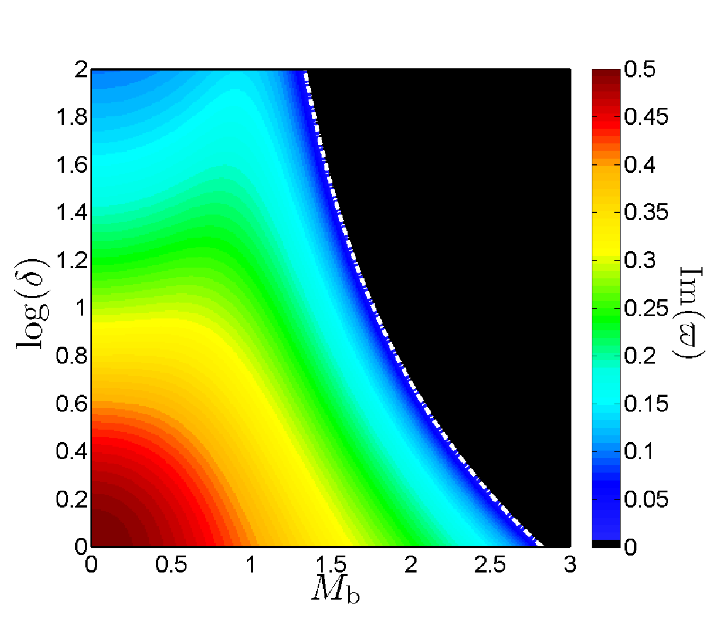
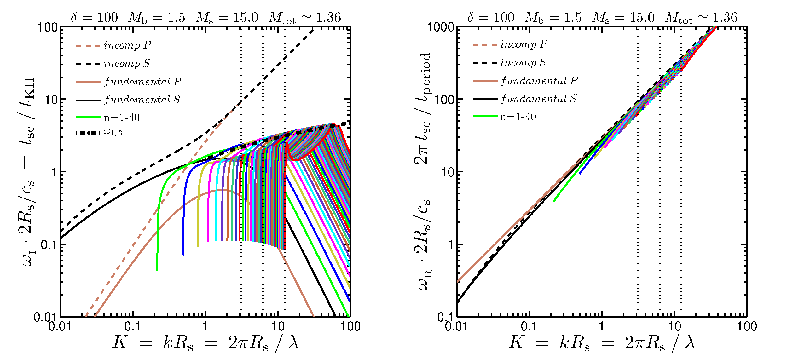
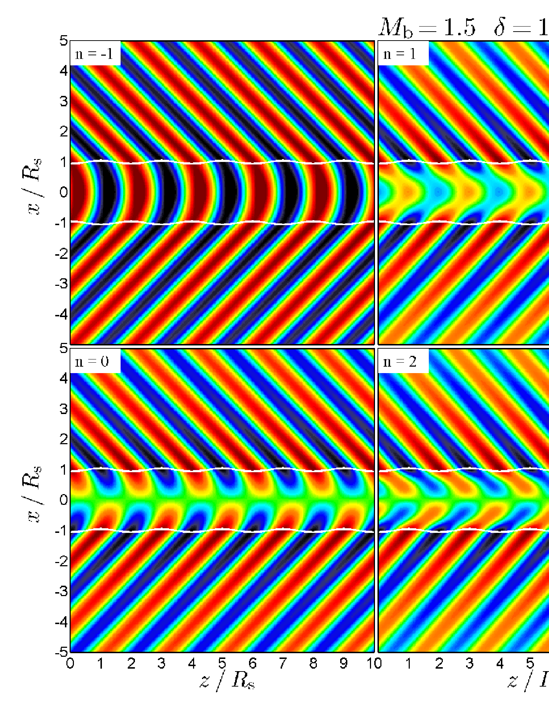
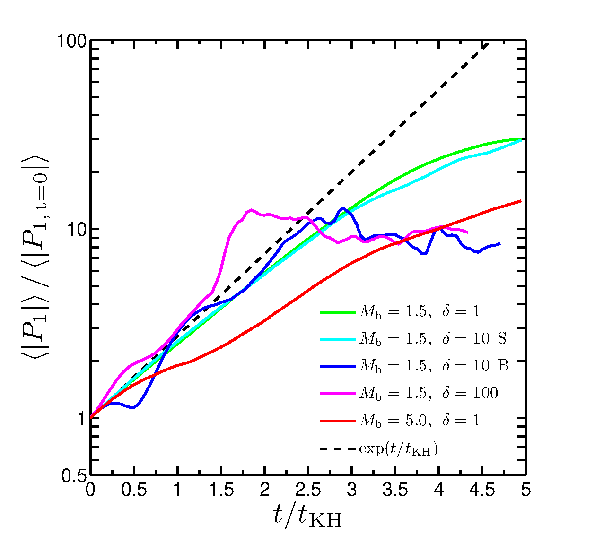
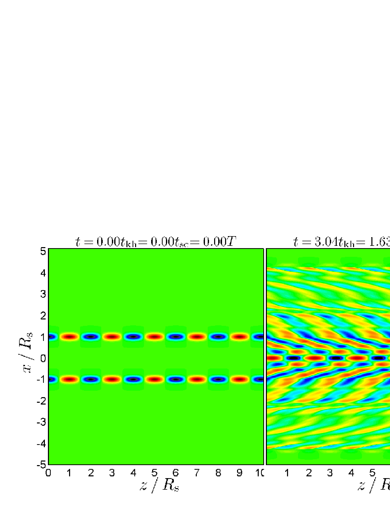
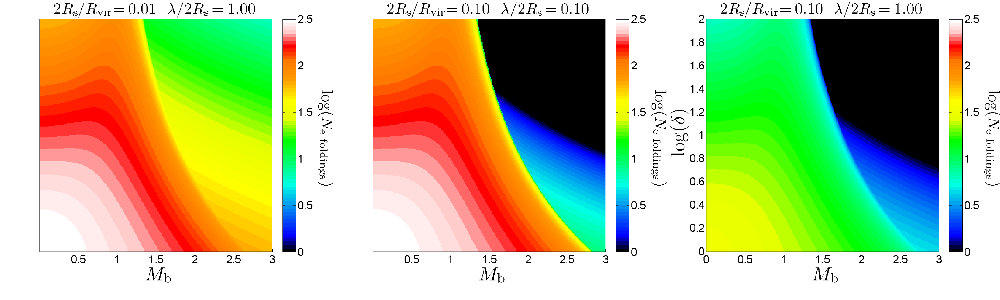

# Cold Stream Stability: A Long Term Research Program, One Physical Ingredient at a Time

**Analytic instability theory + numerical experiments I designed and ran
myself — an eleven-work research program (and counting) built by adding 
one piece of physics at a time, with a governing dimensionless number 
identified at every step.**

Unlike the giant-clumps projects in this repository, where I built the
measurement instruments for simulations run by others, here I posed the
questions, derived the theory, designed and ran the simulations (with the
public AMR code [RAMSES](https://arxiv.org/abs/astro-ph/0111367), extended
through custom patches), and built the analysis. Several stages were led by
students and postdocs I supervised (D. Padnos, H. Aung, Z. Yao), and the program's
predictions have been applied by independent observational teams, including
in a *Science* paper (https://arxiv.org/abs/2303.17484), where I served as 
lead theorist interpreting observations of cold-streams.

## The problem

The most massive galaxies in the young Universe grew by feeding on narrow
streams of cold gas that flowed in along the filaments of the cosmic web,
through halos of hot gas. Whether a stream survives the journey or is
shredded by the Kelvin–Helmholtz instability (KHI) at the interface 
between the fast, cold, dense stream and the hot surroundings, determines
how these galaxies were fed. The stream–halo system is far outside the
regime where classical stability theory applies: the streams are supersonic,
the density contrast is huge, gravity, radiative cooling, and magnetic
fields all act at once, and the nonlinear outcome (disruption vs. survival)
cannot be read off from linear theory.

## The method

Rather than simulating the fully coupled system at once, the program builds
from the bottom-up: start from pure hydrodynamics, then admit one new physical 
ingredient at a time. At each step, we identify the *dimensionless number* that
determines whether the new ingredient changes the leading-order answer:

| Stage | Physics added | Governing number | Key works |
|---|---|---|---|
| 1 | Pure hydro, linear theory (2D sheet/slab + 3D cylinder) | Mach number M_b; density contrast δ | [Mandelker et al. 2016](https://arxiv.org/abs/1606.06289) |
| 2 | Nonlinear evolution (2D, then 3D) | stream radius / shear-layer width | [Padnos, Mandelker et al. 2018](https://arxiv.org/abs/1803.09105); [Mandelker et al. 2019](https://arxiv.org/abs/1806.05677) |
| 3 | Self-gravity | KH disruption time / free-fall time | [Aung, Mandelker et al. 2019](https://arxiv.org/abs/1903.09666); cosmological application: [Mandelker et al. 2018](https://arxiv.org/abs/1711.09108) |
| 4 | Radiative cooling | KH disruption time / mixing-layer cooling time | [Mandelker et al. 2020a](https://arxiv.org/abs/1910.05344) |
| 5 | Cosmological setting + observable prediction | (forward model: Lyman-α emission vs. halo mass & redshift) | [Mandelker et al. 2020b](https://arxiv.org/abs/2003.01724); verified & extended in [Aung, Mandelker et al. 2024](https://arxiv.org/abs/2403.00912) |
| 6 | Thermal shattering; stream–halo pressure contrast | cooling time / sound-crossing time | [Yao, Mandelker et al. 2025](https://arxiv.org/abs/2410.12914); [Yao, Mandelker & Oh 2026](https://arxiv.org/abs/2607.14090) |
| 7 | Magnetic fields | plasma β | as yet unpublished (complete; presented at conferences) |

This repository releases the program in stages. **Stage 1 (linear theory +
its simulation verification) is included below.** The cooling stage, where I 
introduce the theory turbulent radiative mixing layers (TRMLs), is the pivotal 
one. Its full vertical slice of RAMSES patches, analysis pipeline, and plotting 
is currently in preparation, as are conference figures from the unpublished 
magnetic-fields stage.

---

## Stage 1: Linear theory, and making the simulations prove it

`linear_theory/` contains the analytic engine of Mandelker et al. 2016
(MNRAS 463, 3921): a Mathematica notebook (`nir_test_adiabatic.nb`) that
numerically solves the linear dispersion relations for KHI in planar-slab 
geometry, and the MATLAB layer that turns those solutions (along with solutions 
in cylindrical geometries obtained in other notebooks) into growth-rate maps, 
phase diagrams, mode structures, and stability boundaries.


*The parameter space in one figure: KHI growth rate for a single interface
(sheet) as a function of the two governing dimensionless numbers: Mach
number of the stream velocity with respect to the background sound speed, M_b, 
and the density ratio (contrast) between the stream and the background δ. 
From Mandelker et al. 2016, Fig. 1.*

The paper's central result is that in the supersonic regime, where
classical surface modes are stable and one might conclude streams survive,
a family of slower-growing **body modes** (waves reverberating inside the
stream itself) takes over the instability:


*Numerical solution of the slab dispersion relation at M_b = 1.5, δ = 100. In this 
regime, the single interface is stable yet the slab is unstable through body modes. 
Growth rates (left) and phase velocities (right) for the mode families. The solution 
grids behind this figure were produced by the notebook in `linear_theory/`. From 
Mandelker et al. 2016, Fig. 4.*


*What a "body mode" actually is: pressure-perturbation structure of the
first six unstable modes of the slab. While surface modes cling to the
interfaces, body modes fill the interior with standing-wave patterns. From
Mandelker et al. 2016, Fig. 5.*

### Verification: seeding simulations with the theory's eigenmodes

The theory was then tested in RAMSES simulations through a patch 
(`linear_theory/ramses_verification/`) whose initial conditions can perturb 
a single fluid variable *or inject the full analytic eigenmode*. The 
namelist literally takes the complex eigenfrequency computed by the 
Mathematica notebook as an input parameter 
(`pert_omega(1)=(487.286, 318.530)` in `kh_eigenmode.nml`). Two namelists 
are included: one initializing a full eigenmode perturbation and 
one initializing a simple sinusoidal perturbation in the pressure alone.


*The verification: amplitude growth of eigenmode-seeded perturbations in
five simulations spanning the (M_b, δ) parameter space, against the
predicted exponential growth (dashed). From Mandelker et al. 2016, Fig. 8.*


*The stronger test: a simulation seeded with a generic (non-eigenmode)
perturbation spontaneously develops the structure of the predicted
fastest-growing eigenmode (left and centre panels vs. the analytic
prediction on the right) — the simulation "discovers" the theory's answer.
The measured growth rates likewise converge to the fastest-growing mode's
prediction (M16, Fig. 9). From Mandelker et al. 2016, Fig. 10.*

### First application to real streams


*The astrophysical payoff, first version: number of instability e-foldings
a cold stream experiences while crossing its host halo, over the
(M_b, δ) parameter space, for three ratios of the stream radius to the halo 
virial radius and the perturbation wavelength to the stream radius (two additional 
dimensionless numbers). This "can the stream survive?" figure recurs throughout 
the paper series, updated as each new physical ingredient is added. From Mandelker 
et al. 2016, Fig. 11.*

## Contents

```
├── README.md
├── linear_theory/
│   ├── nir_test_adiabatic.nb        ← Mathematica dispersion-relation solver
│   ├── *.m                          ← MATLAB analysis of the solutions
│   ├── sample_output_ImP_00.csv     ← example solver output
│   └── ramses_verification/         ← RAMSES patch (ICs, parameters, both
│                                       namelists) + growth-measurement and
│                                       convergence MATLAB scripts
└── figures/                         ← publication figures (my papers, cited)
```

Stages 2–7 (nonlinear evolution, self-gravity, cooling/TRML with its full
simulation-and-analysis vertical slice, the Lyman-α forward model, and
conference material from the unpublished magnetic-fields study) will be
added incrementally.
