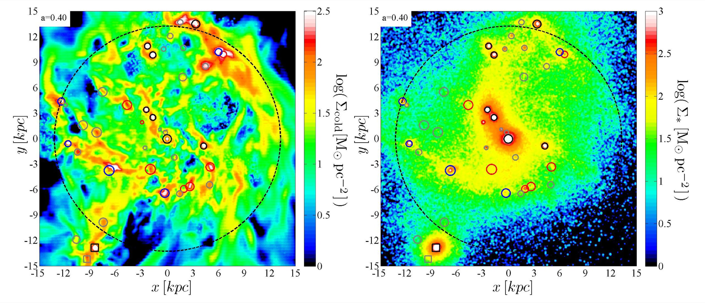
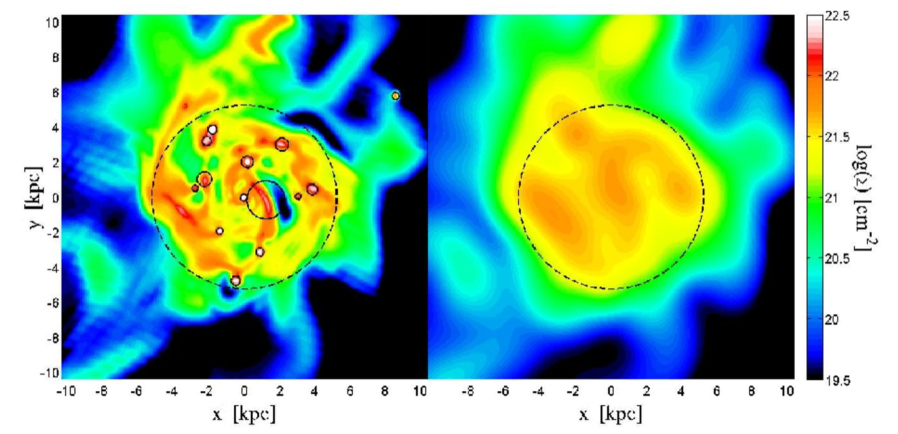
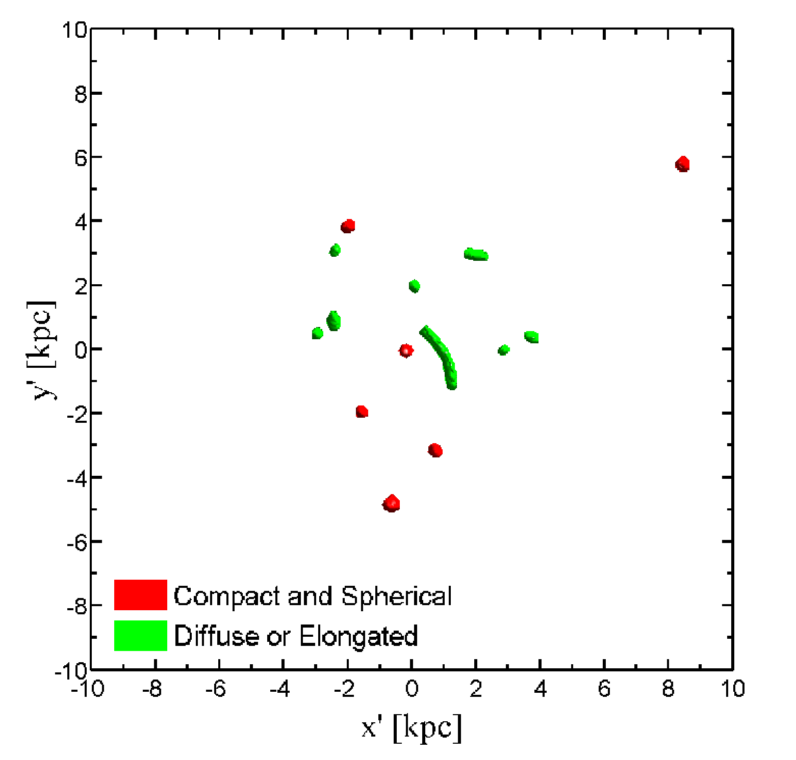
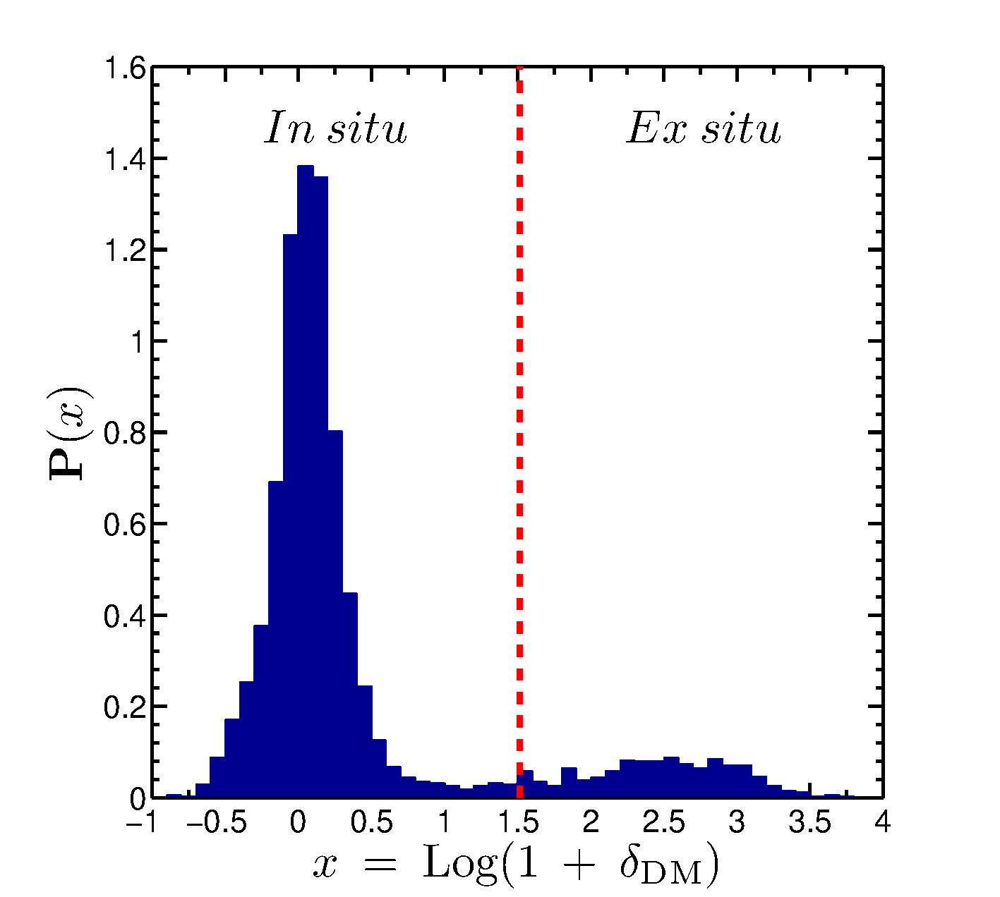
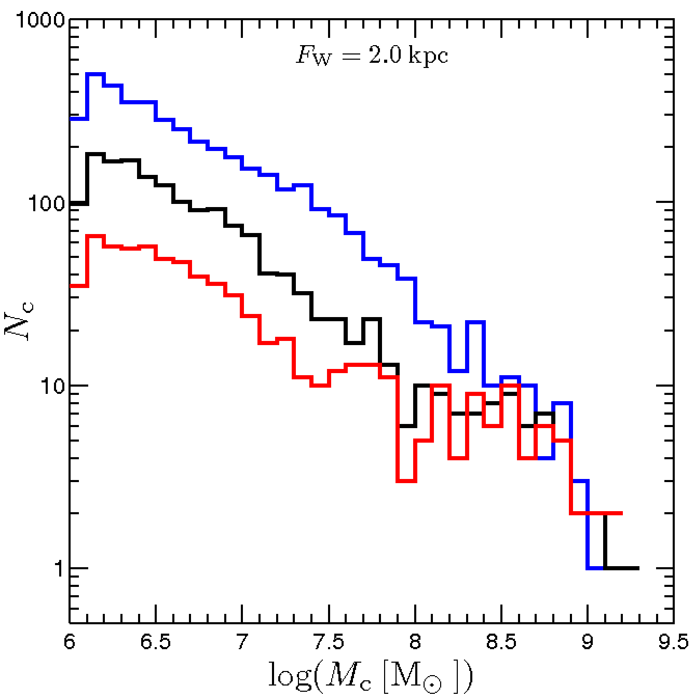
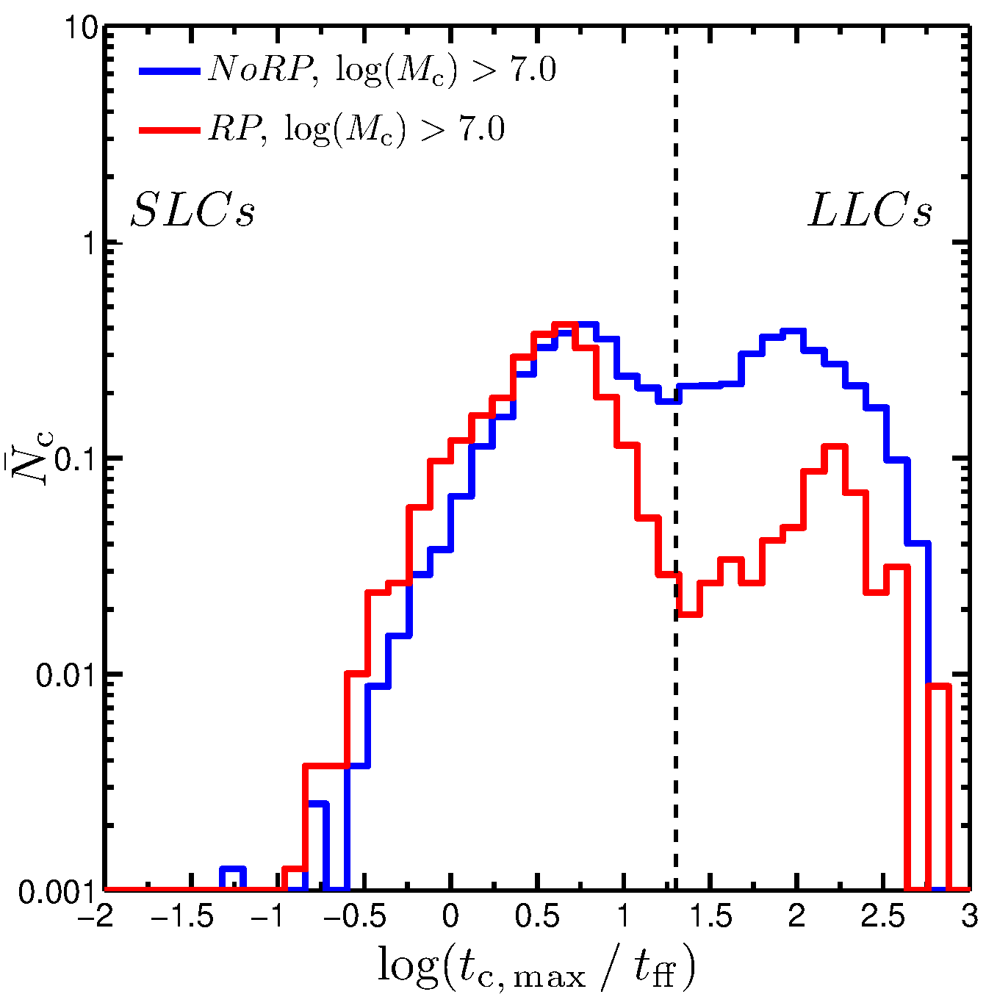
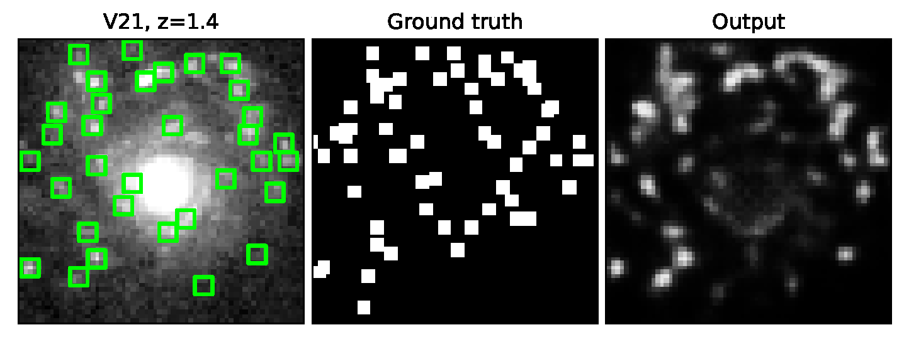
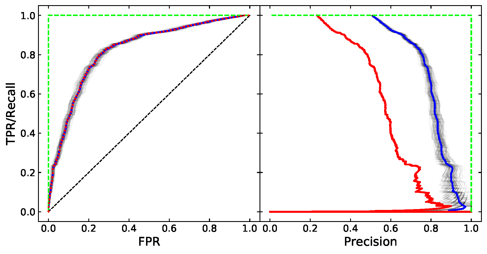

# Giant Clump Finder & Tracker

**Detection, tracking, and classification of transient structures in ~100 TB
of adaptive-resolution simulation data — built from scratch in Fortran 90.**

This is the analysis pipeline behind a series of published studies of "giant
clumps" — dense, star-forming structures that are ubiquitously observed in 
massive disc galaxies ~10 billion years ago, when the rate of star- and 
structure-formation in the Universe was at its peak. These clumps form as 
a result of gravitational instability in rotating discs (Toomre instability), 
and proceed to evolve subject to the external influence of the galaxy and the internal 
effects of star-formation and supernova feedback. I wrote this pipeline as a PhD student and postdoc, 
and it is presented here as-is: research code with commentary,
not a polished software product. The methodology is described in
[Mandelker et al. 2014](https://arxiv.org/abs/1311.0013) (MNRAS 443, 3675) and
[Mandelker et al. 2017](https://arxiv.org/abs/1512.08791) (MNRAS 464, 635).


*Face-on maps of cold gas (left) and stellar (right) surface density in one
simulated galaxy at redshift z = 1.5 — about 9 billion years ago. Circles and squares mark
the clumps detected by this pipeline - circles mark in-situ clumps formed by gravitational 
instability while squares mark ex-situ clumps that merged as separate galaxies; different 
colors denote different clump masses, increasing from grey to red to blue to black, while 
circle size denotes the clump radius. The dashed circle is the disc boundary found by the 
disc finder. From Mandelker et al. 2017, Fig. 1.*

---

## The problem

Cosmological simulations model the formation of individual galaxies over
billions of years of cosmic time. The simulations analyzed here are the VELA
suite: 35 galaxies, each run with three different physics models and with two 
different output cadences, totaling ~100 TB overall. These use ART, an 
*adaptive mesh refinement* (AMR) + N-body code to solve the equations of hydrodynamics 
and gravity in an expanding universe: the computational grid refines itself so that 
dense regions are resolved down to 17–35 parsecs while empty
regions stay coarse. The stellar and dark-matter components of the galaxies are 
treated as collisionless particles subject only to gravity, using N-body dynamics. 
Each simulation produces hundreds of time snapshots.


*The data in motion: gas surface density in one simulated galaxy (VELA V19,
face-on, 40 kpc across) over roughly 2 billion years of cosmic time,
rendered by this pipeline's visualization stage. Narrow streams feed the disc
from the cosmic web while clumps continuously form, orbit, migrate inward,
and are disrupted — the transient objects this pipeline detects and tracks.
A [full-resolution 60-second version](figures/VELA_v2_19_gas_face_on.mp4) is
included in this repository (click "View raw" or download to play).*

The science required answering, for every snapshot of every galaxy:

0. **Defining the system** - what are the dimensions and orientation of the 
   galactic disc within which clumps may form? There was no pre-existing catalog 
   of galaxy disc properties, and these had to be identified and defined before 
   we could begin to search for clumps.
1. **Detection** — which regions of the galaxy's gas and stars are "clumps"?
   There is no labeled training data and no crisp definition; a clump is a
   significant overdensity relative to a smooth, rotating disc whose own
   density varies by orders of magnitude from center to edge.
2. **Measurement** — for each clump: mass, size, shape, internal motions,
   star-formation rate, age, and ~40 other physical properties.
3. **Tracking** — is the clump in snapshot N+1 the same object seen in
   snapshot N? Clumps orbit within the disc, merge, get disrupted, and
   re-form. Gas flows through them, so a clump cannot be tracked by its gas.
4. **Classification** — did the clump form in the disc itself (*in-situ*), or
   is it the remnant of a smaller galaxy that fell in (*ex-situ*)? The two
   populations look similar but have different physical origins, and
   separating them was a central result of this work.

In modern terms: unsupervised object detection and multi-object tracking in
3D scientific data, with the detector, tracker, feature extraction, and
catalog machinery all written from scratch — none of it existed off the shelf
for this data format and problem.

## Pipeline

Each program is a standalone Fortran 90 executable, run in sequence per
simulation; outputs of one stage are inputs to the next.

| Stage | Program | Lines | What it does |
|---|---|---|---|
| 1 | `disc_finder.f90` | 1,739 | Identifies the galactic disc in each snapshot: iteratively determines the center, orientation (from the angular momentum of cold gas and young stars), radius, and height. |
| 2 | `multi_scale_surface_densities_gen3.f90` | 2,401 | Renders face-on and edge-on projected views of each disc at multiple smoothing scales and using multiple tracers (gas of different phases, stars of different ages, dark matter), for visual inspection and sanity-checking of later stages. |
| 3 | `clump_finder_combined.f90` | 5,373 | The core: detects clumps in multiple tracers (gas, stars), measures their properties, tracks them across snapshots, classifies in-situ vs ex-situ. Details below. |
| 4 | `same_clumps.f90`, `collect_clump_data.f90` | 1,258 | Assembles per-snapshot results into cross-time clump catalogs and analysis-ready tables. |
| — | `thin_timesteps/` | 5,810 | Variants of stages 3–4 adapted for simulations with very finely spaced snapshots, including `proto_clump_positions*.f90`, which traces clump material *backwards* in time to study the disc regions where clumps later form ("proto-clumps"). |

Downstream statistical analysis and figure production was done in MATLAB
(a curated selection is in `analysis/`).

## How detection and tracking work

1. **Resampling.** Particle and AMR-cell data are deposited onto a uniform 3D
   grid (up to ~1.6 billion cells) via cloud-in-cell interpolation, with
   cells of each refinement level split appropriately. A built-in check
   verifies that total mass is conserved by the interpolation.
2. **Background estimation.** The smooth disc background is estimated by
   convolving the grid with a wide 3D Gaussian. The convolution is done in
   Fourier space using Intel MKL FFTs — O(N log N) instead of a prohibitively
   expensive direct convolution at these grid sizes.
3. **Detection.** Cells where the residual overdensity, δρ/ρ, exceeds a
   threshold are flagged, and connected components are extracted with a
   recursive flood-fill. Components smaller than 8 cells are discarded;
   catalogs are built at several mass thresholds in parallel so that
   downstream analyses can test how sensitive results are to the definition
   of "clump."
4. **Measurement.** Each clump gets ~40 properties: baryonic/stellar/gas/dark
   matter masses, size, 3D shape (from the eigenvalue decomposition of the inertia
   tensor), velocity dispersion, rotation, star-formation rate and history,
   stellar age, metallicity, virial parameter, and more.
5. **Tracking.** Gas flows through clumps, but stellar particles keep
   persistent IDs across the whole simulation. A clump in snapshot N+1 is
   matched to a progenitor in snapshot N if it contains at least 25% of the
   progenitor's stellar particles (clumps with fewer than 10 stars are deemed
   untrackable). This turns per-snapshot detections into object histories:
   formation, growth, migration, mergers, disruption.
6. **Classification.** In-situ and ex-situ clumps are separated by their dark
   matter content: structures that formed from disc instability contain
   essentially no dark matter, while accreted satellites arrive embedded in
   their own dark matter halos. Alternative definitions of ex-situ are examined 
   as well, such as birthplace of stellar particles and kinematics with respect 
   to the disc kinematics.



*Steps 1–3 visualized for one snapshot. Top pair: the gas surface density
with the disc boundary (dashed) and the 14 detected clumps circled (left),
and the Gaussian-smoothed background estimate the residuals are measured
against (right). Bottom: the grid cells whose residual overdensity exceeds
the detection threshold, from which the connected components are extracted.
From Mandelker et al. 2014, Figs. 3–4.*


*Step 6 visualized: the distribution of dark-matter overdensity at clump
locations is strongly bimodal, so the in-situ/ex-situ classification threshold
sits in a natural gap in the data rather than being imposed arbitrarily. From
Mandelker et al. 2014, Fig. 6.*

## Key design decisions

- **Uniform grid + FFT rather than operating on the native adaptive mesh.**
  Resampling costs memory but makes every downstream step (smoothing,
  thresholding, connected components) simple, regular, and fast. The
  alternative — clump-finding directly on the AMR structure — would have
  entangled the algorithm with the mesh topology for little scientific gain.
- **Detection in the residual, not the raw density.** A fixed density
  threshold cannot work when the disc's own background density spans orders
  of magnitude. Detecting δρ/ρ against a locally estimated background makes
  the detector uniform across the disc, across galaxies, and across cosmic
  time. The smoothing scale is set in physical (not comoving) units, tied to
  the expected clump and disc sizes.
- **Stellar particles as tracers for tracking.** The natural choice — track
  the gas — fails, because gas has no identity between snapshots and flows
  through grid cells inside the clumps. Using the IDs of stellar particles 
  born inside the clump gives a persistent, physically meaningful label. 
- **Tunable definitions as runtime inputs.** The two most consequential
  parameters (smoothing scale and detection threshold) are command-line
  inputs, and catalogs are produced at multiple mass cuts — so robustness to
  definition could be, and was, tested without recompiling.
- **Memory-bounded design.** Grid size is capped by single-node memory; the
  region gridded is restricted to a box around the detected disc rather than
  the full simulation volume.

Each snapshot is processed independently, so the pipeline parallelizes
trivially across snapshots and across simulations as separate cluster 
jobs — within a snapshot the code is serial. The full list of snapshots 
and galaxies desired for analysis was split onto different nodes at runtime 
using a bash script.

## Validation

- **Conservation checks** are built into the resampling step (total mass on
  the grid vs. total mass in the input data).
- **Visual inspection**: the projected disc images from stage 2 were compared
  against detected clump positions systematically. Additional disc images were 
  prepared that included information about clumps detected in each snapshot, such 
  as their position, mass, density, and whether they were detected in gas or stars, 
  so that these could be easily overlaid and validated by-eye.
- **Sensitivity analysis**: results were tested against variations of the
  smoothing scale, detection threshold, and minimum clump mass (multiple
  parallel catalogs; see Mandelker et al. 2014, §2, and Mandelker et al. 2017, §A).

  
  *The clump mass function recovered under different combinations of the
  finder's smoothing scale and detection threshold. The high-mass end is 
  robust to changes in these parameters, as is the slope of the low-mass 
  end, though more lenient definitions of "clump" increase the number of 
  low-mass diffuse clumps. From Mandelker et al. 2017, Fig. A2.*
- **Resolution and physics-model robustness**: key statistics (e.g., clump
  mass functions) were compared across simulation generations with different
  resolutions and feedback physics (Mandelker et al. 2017; Ceverino, Mandelker, et al. 2023).
- **Comparison with observations**: clump properties and abundances were
  compared against published observational samples in the papers above, and those listed below.

## Results and impact

The pipeline produced the clump catalogs behind:

- [Mandelker et al. 2014, MNRAS 443, 3675](https://arxiv.org/abs/1311.0013) —
  methodology; the census of in-situ vs ex-situ clumps; clump migration and
  survival.
- [Mandelker et al. 2017, MNRAS 464, 635](https://arxiv.org/abs/1512.08791) —
  clump properties, evolution, and their dependence on stellar feedback
  physics.
- [Ceverino, Mandelker et al. 2023, MNRAS 522, 3912](https://arxiv.org/abs/2210.15372) — 
  clump analysis in a newer simulation generation, with more aggressive stellar feedback.
- [Dekel, Mandelker, Bournaud et al. 2022, MNRAS 511, 316](https://arxiv.org/abs/2107.13561) — 
  an analytic model of clump evolution, validated against the thin-timestep tracking from this pipeline 
  and compared to observed properties of clumps from HST (see the clump-evolution project in this repository). 
- [Huertas-Company, Guo, Ginzburg, Lee, Mandelker et al. 2020, MNRAS 499, 814](https://arxiv.org/abs/2006.14636) — 
  estimating clump masses in observations using ML models and neural networks trained on simulations using my clump catalog.
- [Ginzburg, Huertas-Company, Dekel, Mandelker et al. 2021, MNRAS 501, 730](https://arxiv.org/abs/2011.06616) — 
  estimating the origin (in-situ or ex-situ) and longevity (long-lived or rapidly disrupted) of clumps in HST observations 
  using an encoder-decoder convolutional neural network trained on simulations using my clump catalog.
- [Inoue, Dekel, Mandelker et al. 2016, MNRAS 456, 2052](https://arxiv.org/abs/1510.07695) — 
  the discovery that clumps form in regions classical stability theory says 
  should be stable (Toomre Q > 1), motivating the turbulence-decomposition project in this repository.
- [Mandelker et al. 2025, MNRAS Letters 538, L9](https://arxiv.org/abs/2406.07633) — 
  an analysis of turbulence in clumpy discs, and specifically in protoclump regions, showing that 
  clumps preferentially form in regions where the compressive-to-solenoidal ratio of turbulence is 
  anomalously high, thus allowing their formation even when Toomre Q>1.
- [Ginzburg, Dekel, Mandelker et al. 2025, A&A 698, A110](https://arxiv.org/abs/2501.07097) — 
  an analysis of the origin of compressive turbulence in protoclump regions in the simulations.

The results of this analysis have also formed the basis of theoretical interpretation of several 
observational studies using HST and JWST (e.g. [Guo et al. 2015, ApJ 800, 39](https://arxiv.org/abs/1410.7398);
[Guo et al. 2018, ApJ 853, 108](https://arxiv.org/abs/1712.01858); 
[Martin et al. 2023, ApJ 955, 106](https://arxiv.org/abs/2308.00041)), 
and I am and have been a member of several such collaborations. 

The pipeline also outlived its original dataset: although written for the raw 
binary outputs of the ART simulation code, it was later adapted to RAMSES 
outputs (for the clump-evolution and turbulence projects in this repository) 
and, most recently, to HDF5 outputs from the moving-mesh code AREPO.


*A science payoff of the tracking: distributions of clump lifetime (in units
of the internal free-fall time) in simulations without (blue) and with (red)
radiation-pressure feedback. The distribution is bimodal — some clumps are
disrupted within a free-fall time while others survive many — and the balance
between the two populations depends on the feedback physics. From Mandelker
et al. 2017, Fig. 7.*


*The catalog as ML training data: a U-Net trained on mock HST observations of
the simulations, labeled with this pipeline's 3D clump catalog. Left: the
mock image with detected clumps boxed. Center: the "ground truth" labels
derived from the catalog. Right: the network's output. From Ginzburg et al.
2021, Fig. 5.*


*Detection performance (ROC and precision–recall curves) of that
neural-network detector — evaluated, again, against this pipeline's catalog
as ground truth. From Ginzburg et al. 2021, Fig. 10.*

## What I'd do differently today

This code is honest about its vintage (the files date to 2019 and earlier,
and the style reflects a physicist writing for himself). With today's
hindsight and tooling:

- **Version control from the start.** This repository is a snapshot of final
  working versions; the development history lives only in filenames like
  `_gen3` and `_v4`.
- **A self-describing data format** (HDF5) instead of raw Fortran binaries
  with layouts that must match exactly between writer and reader. The original 
  version required specific raw Fortran binary file outputs created by the 
  ART simulation code. For the clump evolution and turbulence decomposition 
  projects, the clump finder was adapted to work with different simulation outputs 
  (RAMSES code, also AMR) and more recently it has been adapted to work with HDF5 
  file outputs from AREPO moving-mesh simulations, though these results have not 
  yet been published.
- **Configuration files** instead of compile-time parameters — most settings
  in `module parameters` require recompiling to change.
- **Python for everything that isn't performance-critical.** Today I'd keep
  compiled code only for the hot loops (gridding, FFTs, flood-fill) and do
  orchestration, catalogs, and analysis in Python with tested libraries.
- **Synthetic-data tests.** Injecting artificial clumps of known properties
  and verifying recovery would have made the validation quantitative and
  automatic rather than manual. 
- The header of `clump_finder_combined.f90` still carries my own to-do list
  from the time — including replacing a cell-by-cell particle search with a
  linked list — a small time capsule of the next optimizations I never needed
  to make.

## Contents

```
├── README.md                  ← this file
├── src/                       ← Fortran 90 sources, as last used in production
│   └── thin_timesteps/        ← variants for finely-spaced snapshot outputs
├── analysis/                  ← selected MATLAB analysis scripts
├── figures/                   ← publication figures (from my own papers, cited),
│                                 plus a movie of one disc's evolution
├── galaxy_catalog_sample/     ← example galaxy/disc catalogs (stage-1 output)
│                                 for one galaxy, with a format description
├── sample_images/             ← one snapshot rendered by the pipeline's
│                                 visualization stage in its different modes:
│                                 gas / stars / young stars / dark matter,
│                                 face-on and edge-on
└── sample_output/             ← example clump catalogs for one simulation,
                                  with a column-by-column format description
```

The raw simulation snapshots (terabytes) cannot be redistributed here; the
sample outputs and figures show what the pipeline produces.
