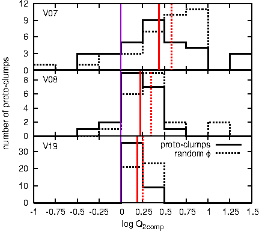
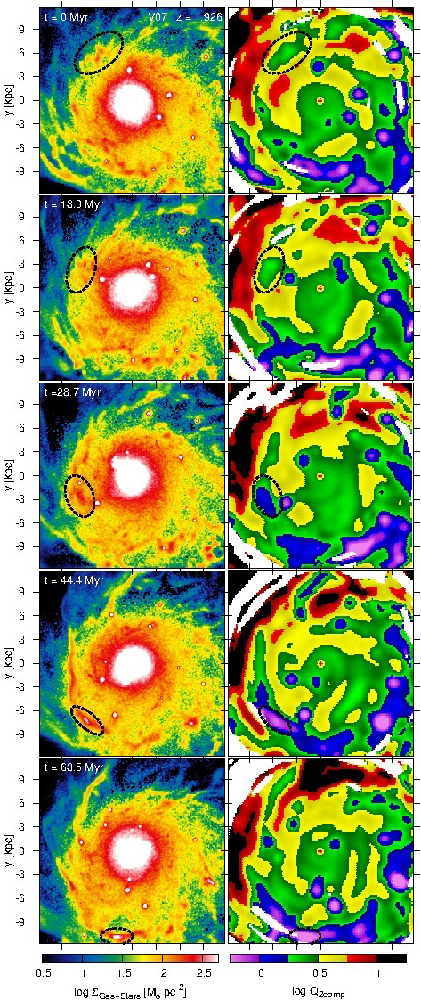
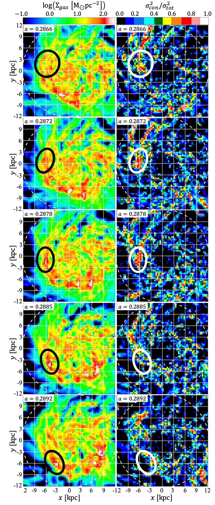
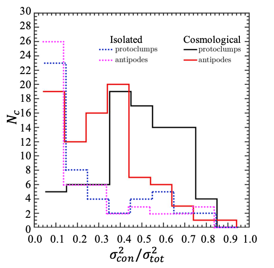
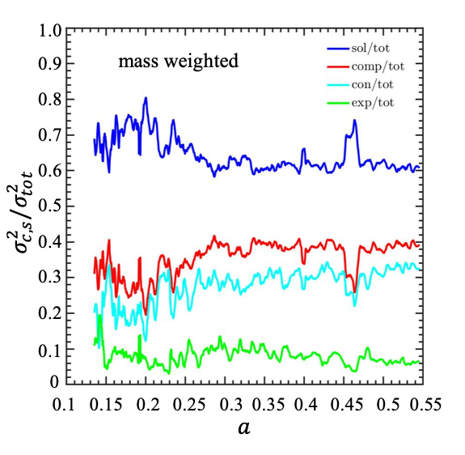

# Turbulence Decomposition: Why Clumps Form Where Theory Says They Shouldn't

**Helmholtz decomposition of turbulent velocity fields in simulated galaxies
— Fortran 90 + Intel MKL FFTs on ~10⁸-cell grids — with validation on
synthetic turbulence with known ground truth.**

This project resolved a puzzle raised by the clump catalogs in this
repository: [Inoue, Dekel, Mandelker et al. 2016](https://arxiv.org/abs/1510.07695)
(MNRAS 456, 2052) found that giant clumps form in disc regions that
classical stability analysis (the Toomre Q criterion) says should be
*stable*. We hypothesized the culprit was the *character* of the local
turbulence, and built the measurement to test it. The result, that 
proto-clump regions carry an anomalous excess of compressive turbulence, 
is published in [Mandelker, Ginzburg, Dekel et al. 2025](https://arxiv.org/abs/2406.07633)
(MNRAS Letters 538, L9), with the physical origin of the compressive excess
traced in [Ginzburg, Dekel, Mandelker et al. 2025](https://arxiv.org/abs/2501.07097)
(A&A 698, A110).


*The puzzle: the stability parameter Q_2comp (a 2-component Q parameter 
accounting for both gas and stars) measured at proto-clump locations (solid) 
versus random disc locations (dashed) in three simulated galaxies. Clumps 
form at Q values well above the classical instability threshold (Q < 1, left 
of the purple line). From Inoue et al. 2016, Fig. 11.*

## The measurement problem

Any turbulent velocity field can be split, uniquely, into a **compressive**
part (converging/diverging flows, the part that can gather mass into
clumps) and a **solenoidal** part (rotational eddies, the part that mostly
just stirs). Mathematically this Helmholtz decomposition is clean: Fourier
transform the velocity field and project each mode onto (compressive) and
perpendicular to (solenoidal) its wavevector.

Doing it in a *real galactic disc* is the hard part:

- The disc's ordered rotation and shear are ~10× larger than the turbulence
  and are neither compressive nor turbulent. These must be removed without
  distorting what remains.
- The disc is thin and stratified; the analysis must respect the slab
  geometry rather than assume isotropy and periodicity (typically required 
  for FFTs).
- The velocity field lives on an adaptive mesh and must be resampled
  (cloud-in-cell, with conservation checks) onto uniform grids with up 
  to ~2.7×10⁸ cells per snapshot, before FFTs (Intel MKL) are applicable.

`src/ART_decomposition_v11_thin.f90` implements this for the VELA
simulations; `src/ramses_variant/` is the port for the isolated-galaxy
RAMSES simulations. All choices are runtime options in
`parameter_input_v11.dat`. These include three strategies for removing the
bulk flow (none / subtract the azimuthally averaged rotation curve /
subtract a locally smoothed mean field) and three weightings of the
decomposed field (velocity, momentum, or energy-weighted). The
sensitivity of every result to these definitions could be, and was, tested.

## Validation with known ground truth

The part of this project I'd highlight first:
`src/synthetic_box_tests/turbulence_test.f90` **generates synthetic
turbulent boxes where the right answer is known in advance**, a random
velocity field with a prescribed power-spectrum slope and, critically, a
*prescribed solenoidal-to-compressive ratio* (built out from seed code
shared by a colleague, acknowledged in the paper). It can also inject a
disc-like rotation profile on top. The
decomposition pipeline is then run on these boxes
(`local_decomp_test.f90`) to verify that it recovers the injected mode
ratio, and that ordered rotation does not leak into the measured turbulence.

This is the discipline the clump finder's README lists under "what I'd do
differently today", namely synthetic-data tests with injected ground truth, 
applied a decade later. The lesson stuck. The same goes for configuration:
where the clump finder's parameters were compile-time constants, everything
here reads from a runtime input file.

An additional, independent layer of validation: for the companion study
(Ginzburg et al. 2025), Omry Ginzburg wrote his own decomposition code from
scratch, deliberately not reusing mine, and reproduced the results
self-consistently before extending them.

## Results


*The original 2016 evidence: time sequence of a clump forming (dashed
circles) in a region where the stability map (right column) says Q > 1. 
Such regions are expected to be stable to gravitational collapse. From 
Inoue et al. 2016, Fig. 10.*


*The resolution of the puzzle, visually: gas surface density (left) and the
fraction of turbulent energy in converging flows (right) over five closely
spaced snapshots. A clump condenses (circled) precisely where the
compressive fraction is anomalously high before any clump is visible in
the density map. This is the same clump-formation event shown through the
Toomre Q lens in the maps above, closing the loop between the puzzle and its 
resolution. From Mandelker et al. 2025, Fig. 3.*


*The statistical version: distributions of the converging-flow energy
fraction in proto-clump regions (black) versus matched control regions on
the opposite side of the disc (red), in both a cosmological and an isolated
galaxy simulation. The strong excess in compressive power in proto-clump regions 
is a cosmological phenomenon, missing from isolated galaxy simulations, where 
clump formation appears to follow standard Toomre theory. From Mandelker et al. 2025, Fig. 4.*


*Fraction of turbulent power in compressive vs. solenoidal modes across the
simulation's history, from the decomposition pipeline. Despite local excesses in 
compressive power in proto-clump positions, the disc as a whole is close to equipartition. 
From Mandelker et al.
2025, Fig. 2.*

Downstream MATLAB post-processing of the decomposition outputs is in
`analysis/` (`sol_over_comp.m` — the compressive-to-solenoidal ratio
time series behind the Letter's figures; `turbulence_density_maps.m` —
the map-based figures).

## Contents

```
├── README.md
├── src/
│   ├── ART_decomposition_v11_thin.f90   ← the decomposition pipeline (VELA/ART)
│   ├── parameter_input_v11.dat          ← runtime configuration, documented inline
│   ├── ramses_variant/                  ← port for RAMSES isolated-galaxy sims
│   └── synthetic_box_tests/             ← ground-truth turbulent-box generator
│                                           + decomposition verification
├── analysis/                            ← MATLAB post-processing
└── figures/                             ← publication figures (my papers, cited)
```

Simulation outputs (~10⁴ binary grid files per galaxy) are not included.
